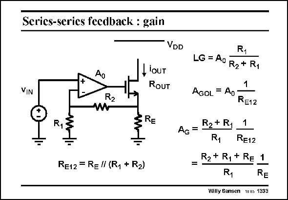

# SANSEN-1333 · Scries-series fecdback : gain

章节：13 反馈电压放大器与跨导放大器  
PDF 页：372；书本页：379；幻灯片编号：1333  
状态：unreviewed



## 对应教材讲解

### PDF 372 · 书本 379

An accurate transconductor is shown in this slide. The output current is provided by a MOST which is driven by an opamp. It is accurately linked to the input voltage v by the three IN resistors used. Indeed, the closed loop gain A , which G is nothing else than i /v , OUT IN only contains resistor ratios and the absolute value of one resistor R ! E12 The loop gain LG itself and the open loop gain A both contain the gain GOL of the opamp A . However, this gain does not occur in the closed loop gain A ! 0 G

## 公式／性能结论候选摘录

以下为规则截取的原文，尚未逐项判读。

- PDF 372: Indeed, the closed loop gain A , which G is nothing else than i /v , OUT IN only contains resistor ratios and the absolute value of one resistor R !
- PDF 372: E12 The loop gain LG itself and the open loop gain A both contain the gain GOL of the opamp A .
- PDF 372: However, this gain does not occur in the closed loop gain A ! 0 G

## 曲线结论候选摘录

以下为规则截取的原文，尚未逐项判读。

（未由规则找到；不代表原页没有此类内容。）

## 原文条件与近似候选摘录

以下为规则截取的原文，尚未逐项判读。

- PDF 372: The output current is provided by a MOST which is driven by an opamp.

## 幻灯片 OCR（未校正）

```text
Scries-series fecdback : gain
VDD
lOUT
RoUT
VIN
R2
R
RE
RE12 = Rel (R, + R2)
R1
LG = A0 R2 + R,
AGOL = Ao
RE12
Ao= B2+ Ry
R1
RE12
R2 + R1 + Re 1
R1
RE
Willy Sansen muus 1333
```

数学上下标、分数及正负号以原图为准。电路图已保留；未核对的连接不输出成可仿真 netlist。
