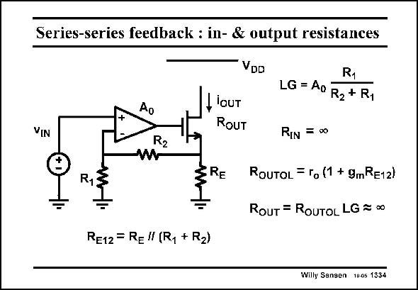

# SANSEN-1334 · Series-series feedback : in- & output resistances

章节：13 反馈电压放大器与跨导放大器  
PDF 页：373；书本页：380；幻灯片编号：1334  
状态：unreviewed



## 对应教材讲解

### PDF 373 · 书本 380

The input resistance of this converter is evidently infinity as no Gate current is flowing. The output resistance is increased by the loop gain LG. The open-loop output resistance R is easily OUTOL obtained for a single-transistor amplifier with Source resistor R . It is therefore E already quite high. It is increased even more by the feedback action.

## 公式／性能结论候选摘录

以下为规则截取的原文，尚未逐项判读。

- PDF 373: The output resistance is increased by the loop gain LG.
- PDF 373: It is therefore E already quite high.
- PDF 373: It is increased even more by the feedback action.

## 曲线结论候选摘录

以下为规则截取的原文，尚未逐项判读。

（未由规则找到；不代表原页没有此类内容。）

## 原文条件与近似候选摘录

以下为规则截取的原文，尚未逐项判读。

（未由规则找到；不代表原页没有此类内容。）

## 幻灯片 OCR（未校正）

```text
Series-series feedback : in- & output resistances
VIN
R2
R1
W
VDD
R1
LG = A° R2 + R,
-lOUT
RouT
RIN = ∞0
ERE
RouTOL = ro (1 + 9mRE12)
RouT = RoUTOL LG = ∞0
RE12 = R= " (R, + R2)
Willy Sansen 100s 1334
```

数学上下标、分数及正负号以原图为准。电路图已保留；未核对的连接不输出成可仿真 netlist。
