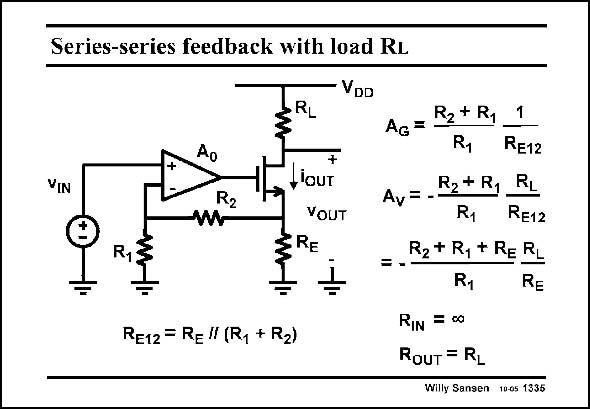

# SANSEN-1335 · Series-series feedback with load RL

章节：13 反馈电压放大器与跨导放大器  
PDF 页：373；书本页：380；幻灯片编号：1335  
状态：unreviewed



## 对应教材讲解

### PDF 373 · 书本 380

The addition of a load resistor R , converts this trans- L conductor into a voltage amplifier again, with very accurate gain A . v This gain only depends on resistor ratios, and can be accurately set. The output resistance towards the Drain of the output transistor is quite high. As a result, the output resistance seen at the output of the whole amplifier is mainly load resistor R . L

## 公式／性能结论候选摘录

以下为规则截取的原文，尚未逐项判读。

- PDF 373: The addition of a load resistor R , converts this trans- L conductor into a voltage amplifier again, with very accurate gain A . v This gain only depends on resistor ratios, and can be accurately set.
- PDF 373: As a result, the output resistance seen at the output of the whole amplifier is mainly load resistor R .

## 曲线结论候选摘录

以下为规则截取的原文，尚未逐项判读。

（未由规则找到；不代表原页没有此类内容。）

## 原文条件与近似候选摘录

以下为规则截取的原文，尚未逐项判读。

（未由规则找到；不代表原页没有此类内容。）

## 幻灯片 OCR（未校正）

```text
Series-series feedback with load RL
VIN
Ao
R2
R1
RL
VDD
+
, IOUT
VOUT
ERE
RE12 = R= " (R, + R2)
AG= R2+R,
1
R1
RE12
R2* R1
RL
Av= -
R1
RE12
=--
R2 + R, + RE RL
R1
RE
RIN = 60
RouT = RL
Willy Sansen 1005 1335
```

数学上下标、分数及正负号以原图为准。电路图已保留；未核对的连接不输出成可仿真 netlist。
