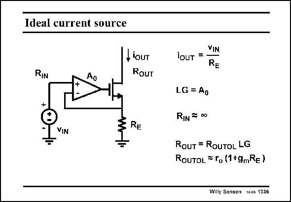

# SANSEN-1336 · Ideal current source

章节：13 反馈电压放大器与跨导放大器  
PDF 页：374；书本页：381；幻灯片编号：1336  
状态：unreviewed



## 对应教材讲解

### PDF 374 · 书本 381

The gain resistors R and R 1 2 can be left out in the previous transconductor, resulting into the simpler one shown in this slide. It is probably the simplest way to convert a voltage into a current, with high accuracy. The voltage-to-current conversion only depends on resistor R . E The input resistance is again high and so is the output resistance. This circuit now acts as an ideal current generator.

## 公式／性能结论候选摘录

以下为规则截取的原文，尚未逐项判读。

- PDF 374: The gain resistors R and R 1 2 can be left out in the previous transconductor, resulting into the simpler one shown in this slide.
- PDF 374: The voltage-to-current conversion only depends on resistor R .

## 曲线结论候选摘录

以下为规则截取的原文，尚未逐项判读。

（未由规则找到；不代表原页没有此类内容。）

## 原文条件与近似候选摘录

以下为规则截取的原文，尚未逐项判读。

（未由规则找到；不代表原页没有此类内容。）

## 幻灯片 OCR（未校正）

```text
Ideal current source
LiouT
RouT
RIn
+
RE
VIN
VIN
iOUT =
RE
LG = Ao
RIN = D0
ROUT = ROUTOL LG
ROUTOL = ro (1+gmRE)
Willy Sansen 1005 1336
```

数学上下标、分数及正负号以原图为准。电路图已保留；未核对的连接不输出成可仿真 netlist。
