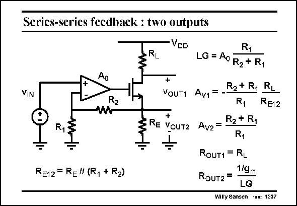

# SANSEN-1337 · Series-series feedback : two outputs

章节：13 反馈电压放大器与跨导放大器  
PDF 页：374；书本页：381；幻灯片编号：1337  
状态：unreviewed



## 对应教材讲解

### PDF 374 · 书本 381

The precise transconductor analyzed before, has two outputs, one at the Drain as before, but also one at the Source of the output transistor. What is the difference? The first difference is that these two outputs have opposite polarities. Also, the loop gain is the same for both, but not the actual closed-loop voltage gains. The first one A , at the v1 Drain, is larger. The output resistances are also very different. The second one R , at the Source, is much smaller, because it is only of the order of magnitude OUT2 of 1/g and it involves the loop gain LG. Connection of a capacitive load at the second output m would give a pole at high frequencies only.

## 公式／性能结论候选摘录

以下为规则截取的原文，尚未逐项判读。

- PDF 374: Also, the loop gain is the same for both, but not the actual closed-loop voltage gains.
- PDF 374: The second one R , at the Source, is much smaller, because it is only of the order of magnitude OUT2 of 1/g and it involves the loop gain LG.

## 曲线结论候选摘录

以下为规则截取的原文，尚未逐项判读。

（未由规则找到；不代表原页没有此类内容。）

## 原文条件与近似候选摘录

以下为规则截取的原文，尚未逐项判读。

- PDF 374: The second one R , at the Source, is much smaller, because it is only of the order of magnitude OUT2 of 1/g and it involves the loop gain LG.

## 幻灯片 OCR（未校正）

```text
Series-series feedback : two outputs
VDD
RL
VIN
R2
R
RE12 = RE" (R, + R2)
R1
LG= A0 R2+ R,
+
R2+ R1
RL
VOUT1 Av1
=-
R1
RE12
+
RE VOUT2
R2 + R1
Av2
R1
ROUT1 = RL
1/gm
RouT2 =
LG
Willy Sansen uus 1337
```

数学上下标、分数及正负号以原图为准。电路图已保留；未核对的连接不输出成可仿真 netlist。
