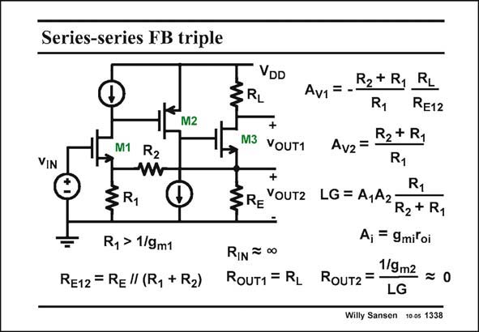

# SANSEN-1338 · Series-series FB triple

章节：13 反馈电压放大器与跨导放大器  
PDF 页：375；书本页：382；幻灯片编号：1338  
状态：unreviewed



## 对应教材讲解

### PDF 375 · 书本 382

A transistor realization of the last circuit is shown in this slide. Two transistors M1 and M2 are used to realize the operational amplifier. A pMOST is used as a second stage to provide downwards level shifting. The expressions are exactly as before. The closed-loop gains A and v1 A are exactly the same as v2 before. Now the gain A of the 0 opamp has to be substituted by the gains of the two transistors. Each transistor provides a gain g r , as indicated. The loop gain LG depends on m o both gains. The input-and output-resistances are as before.

## 公式／性能结论候选摘录

以下为规则截取的原文，尚未逐项判读。

- PDF 375: Now the gain A of the 0 opamp has to be substituted by the gains of the two transistors.
- PDF 375: Each transistor provides a gain g r , as indicated.
- PDF 375: The loop gain LG depends on m o both gains.

## 曲线结论候选摘录

以下为规则截取的原文，尚未逐项判读。

（未由规则找到；不代表原页没有此类内容。）

## 原文条件与近似候选摘录

以下为规则截取的原文，尚未逐项判读。

（未由规则找到；不代表原页没有此类内容。）

## 幻灯片 OCR（未校正）

```text
Series-series FB triple
VIN
M2
M1 R2
VDD
3RL
R2+ R1
Av1 = --
R1
RL
RE12
+
M3
YOUT1
R2 + R1
Av2 = -
R1
+
§R,
SRE YOUTZ LG= A,A2R2+ R1
Ry > 1/9m1
RIN = 00
Aj = 9miloi
1/9m2
RE12 = REl (R, + R2) RouT1 = R1 RouT2= -
LG
Willy Sansen 10 0s 1338
```

数学上下标、分数及正负号以原图为准。电路图已保留；未核对的连接不输出成可仿真 netlist。
