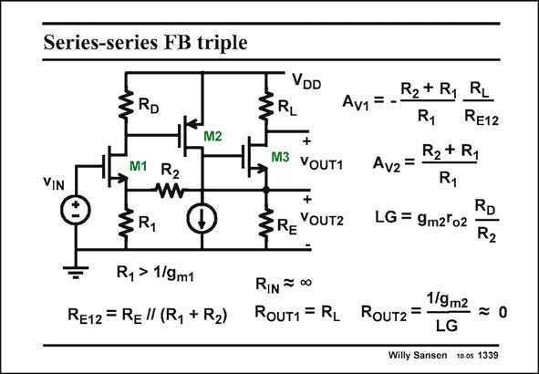

# SANSEN-1339 · Series-series FB triple

章节：13 反馈电压放大器与跨导放大器  
PDF 页：375；书本页：382；幻灯片编号：1339  
状态：unreviewed



## 对应教材讲解

### PDF 375 · 书本 382

Substitution of the load current source of the input transistor by a load resistor R , reduces the loop gain L LG somewhat. The gain of the input transistor is not fully exploited any more. However, the closed-loop gains A and A are v1 v2 exactly the same as before. Input and output impedances are the same as well.

## 公式／性能结论候选摘录

以下为规则截取的原文，尚未逐项判读。

- PDF 375: Substitution of the load current source of the input transistor by a load resistor R , reduces the loop gain L LG somewhat.
- PDF 375: The gain of the input transistor is not fully exploited any more.

## 曲线结论候选摘录

以下为规则截取的原文，尚未逐项判读。

（未由规则找到；不代表原页没有此类内容。）

## 原文条件与近似候选摘录

以下为规则截取的原文，尚未逐项判读。

（未由规则找到；不代表原页没有此类内容。）

## 幻灯片 OCR（未校正）

```text
Series-series FB triple
3RD
M2
VIN
VDD
3RL
+
M3
YOUT1
+
§RE YOUTZ
M1 R2
§R,
Ry > 1/9m1
Re12 = Re"(Ry +R2)
R2+ R1
Av1 = -•
R1
RL
RE12
R2 + R1
Av2 = -
R1
RD
LG = 9m2'o2
R2
RIN = 00
1/9m2
ROUT1 = RL RoUT2 = -
LG
Willy Sansen 10 0s 1339
```

数学上下标、分数及正负号以原图为准。电路图已保留；未核对的连接不输出成可仿真 netlist。
