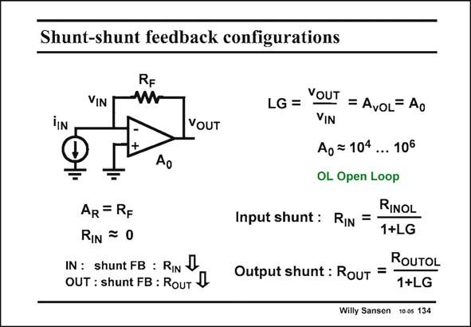

# SANSEN-134 · Shunt-shunt feedback configurations

章节：13 反馈电压放大器与跨导放大器  
PDF 页：358；书本页：365；幻灯片编号：134  
状态：unreviewed



## 对应教材讲解

### PDF 357 · 书本 364

One of the simplest cases of feedback is an operational amplifier with a resistor from the output to the input. Of course, the feedback resistor has to be connected to the negative input. Otherwise the loop gain would build up an ever-increasing output voltage, only to stop at the positive supply voltage. Stable feedback is always negative feedback. This is a case of shunt (or parallel) feedback at both input and output. Output shunt feedback means that the output terminal is in parallel with the feedback element terminal. This is also the case at the input. The gain of the amplifier itself is A , which is also quite large, between 10.000 and 1.000.000. 0 This is also the loop gain LG, as will be calculated on the next slide.

### PDF 358 · 书本 365

The output voltage simply equals the input current into the feedback resistor. The closed-loop gain is simply R . It is therefore F a transresistance amplifier with gain R . F The input and output resistances are both affected by the feedback. In the case of shunt feedback, the resistance decreases by an amount equal to the loop gain LG, or actually 1+LG.

## 公式／性能结论候选摘录

以下为规则截取的原文，尚未逐项判读。

- PDF 357: Otherwise the loop gain would build up an ever-increasing output voltage, only to stop at the positive supply voltage.
- PDF 357: The gain of the amplifier itself is A , which is also quite large, between 10.000 and 1.000.000. 0 This is also the loop gain LG, as will be calculated on the next slide.
- PDF 358: The output voltage simply equals the input current into the feedback resistor.
- PDF 358: The closed-loop gain is simply R .
- PDF 358: It is therefore F a transresistance amplifier with gain R .
- PDF 358: In the case of shunt feedback, the resistance decreases by an amount equal to the loop gain LG, or actually 1+LG.

## 曲线结论候选摘录

以下为规则截取的原文，尚未逐项判读。

（未由规则找到；不代表原页没有此类内容。）

## 原文条件与近似候选摘录

以下为规则截取的原文，尚未逐项判读。

（未由规则找到；不代表原页没有此类内容。）

## 幻灯片 OCR（未校正）

```text
Shunt-shunt feedback configurations
VIN
RF
W
VOUT
AR = RF
RIN = 0
IN: shunt FB : RIN
OUT : shunt FB : RouT J
LG = VOUT = AvOL= Ao
Ao =104 ... 106
OL Open Loop
Input shunt : RIN = -
RINOL
1+LG
ROUTOL
Output shunt : Rouт =
1+LG
Willy Sansen 10 os 134
```

数学上下标、分数及正负号以原图为准。电路图已保留；未核对的连接不输出成可仿真 netlist。
