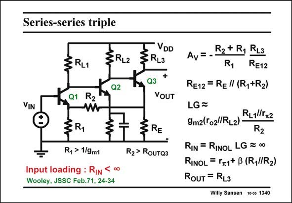

# SANSEN-1340 · Series-series triple

章节：13 反馈电压放大器与跨导放大器  
PDF 页：376；书本页：383；幻灯片编号：1340  
状态：unreviewed



## 对应教材讲解

### PDF 376 · 书本 383

Substitution of all current sources by resistors provides this well-known feedback amplifier with a triple gain stage if the Drain of Q3 is taken as an output. This is an amplifier which is easy to realize with discrete components, especially with bipolar transistors. The closed-loop gain A v is as before. The loop gain is also similar as before. The resistive division at each node has to be taken into account. The input resistance R is not infinity as a bipolar transistor is used at the input. It is quite IN high however, because of the feedback action. The output resistance R is mainly load OUT resistor R . L3

## 公式／性能结论候选摘录

以下为规则截取的原文，尚未逐项判读。

- PDF 376: Substitution of all current sources by resistors provides this well-known feedback amplifier with a triple gain stage if the Drain of Q3 is taken as an output.
- PDF 376: The closed-loop gain A v is as before.
- PDF 376: The loop gain is also similar as before.

## 曲线结论候选摘录

以下为规则截取的原文，尚未逐项判读。

（未由规则找到；不代表原页没有此类内容。）

## 原文条件与近似候选摘录

以下为规则截取的原文，尚未逐项判读。

（未由规则找到；不代表原页没有此类内容。）

## 幻灯片 OCR（未校正）

```text
Series-series triple
§RL2
Q2
VIN
®
3 RL1
Q1
R2
§R,
R, > 1/gm1
Input loading : RIn
Wooley, JSSC Feb.71, 24-34
VDD
3RL3
+
Q3
YOUT
RE
R2> Rouтаз
co
R2+ Ry RL3
Av
R1
RE12
RE12 = Re" (R,+R2)
LG=
RL1lT+2
9m2(To2/ RL2)
R2
RIN = RINOL LG = 00
RINOL = 5r1+ B (R,//R2)
ROUT = RL3
Willy Sansen 10-05 1340
```

数学上下标、分数及正负号以原图为准。电路图已保留；未核对的连接不输出成可仿真 netlist。
