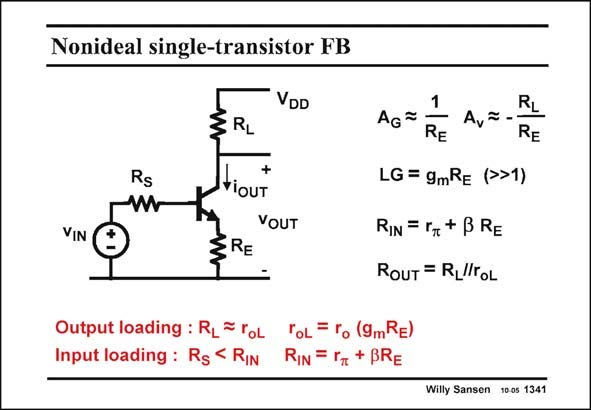

# SANSEN-1341 · Nonideal single-transistor FB

章节：13 反馈电压放大器与跨导放大器  
PDF 页：376；书本页：383；幻灯片编号：1341  
状态：unreviewed



## 对应教材讲解

### PDF 376 · 书本 383

Series-series feedback is also possible on a single-transistor amplifier. However, it is not so easy to distinguish the closed and open-loop gains and the loop gain. This is also called local feedback. The transconductance and voltage gain are more accurate, the more g R is m E larger than unity. This requires a large DC voltage drop across emitter resistor R , however! E The loop gain LG and the input resistance are not all that large either. The output resistance r looking into the Collector of the transistor is not all that large either. oL The output resistance R is thus a parallel combination of both the load resistor R and the OUT L transistor output resistance r . oL As a consequence, both input and output loading occur, i.e. the source resistance R interacts S with the input resistance R . Also the load resistor R interacts with the transistor output IN L resistance r . oL This circuit is far from an ideal-feedback circuit. It is better to be analyzed by straight analysis using the two laws of Kirchoff.

## 公式／性能结论候选摘录

以下为规则截取的原文，尚未逐项判读。

- PDF 376: However, it is not so easy to distinguish the closed and open-loop gains and the loop gain.
- PDF 376: The transconductance and voltage gain are more accurate, the more g R is m E larger than unity.
- PDF 376: E The loop gain LG and the input resistance are not all that large either.
- PDF 376: The output resistance r looking into the Collector of the transistor is not all that large either. oL The output resistance R is thus a parallel combination of both the load resistor R and the OUT L transistor output resistance r . oL As a consequence, both input and output loading occur, i.e. the source resistance R interacts S with the input resistance R .

## 曲线结论候选摘录

以下为规则截取的原文，尚未逐项判读。

（未由规则找到；不代表原页没有此类内容。）

## 原文条件与近似候选摘录

以下为规则截取的原文，尚未逐项判读。

（未由规则找到；不代表原页没有此类内容。）

## 幻灯片 OCR（未校正）

```text
Nonideal single-transistor FB
DD
VIN
Rs
W
3
RL
YiOUT
+
VOUT
§RE
AG
Ay
RE
LG = 9mRE (>>1)
RIN =r+BRE
ROUT = RLlTOL
Output loading: R_= roL
ToL = ro (9mRE)
Input loading: Rs< Rin
RIN = "n + BRE
RL
RE
Willy Sansen 10 os 1341
```

数学上下标、分数及正负号以原图为准。电路图已保留；未核对的连接不输出成可仿真 netlist。
