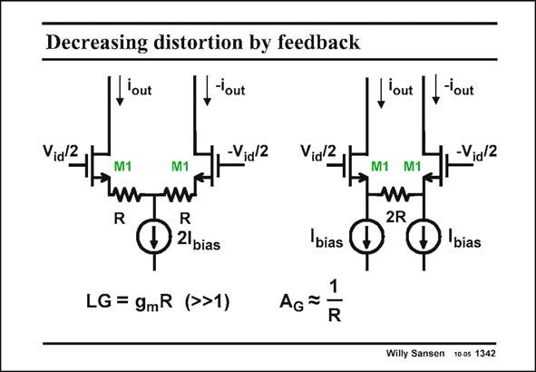

# SANSEN-1342 · Decreasing distortion by feedback

章节：13 反馈电压放大器与跨导放大器  
PDF 页：377；书本页：384；幻灯片编号：1342  
状态：unreviewed



## 对应教材讲解

### PDF 377 · 书本 384

The previous series-feedback single-transistor amplifier can easily be realized in a differential configuration. Again, the larger the emitter resistors R, the better the feedback works. To avoid the large DC voltage drops across the resistors, the circuit on the right is preferred. This latter circuit provides the same gains, but no DC current flows through the emitter resistors. It can be used at lower supply voltages. Its noise performance is slightly worse, however (see Chapter 4).

## 公式／性能结论候选摘录

以下为规则截取的原文，尚未逐项判读。

（未由规则找到；不代表原页没有此类内容。）

## 曲线结论候选摘录

以下为规则截取的原文，尚未逐项判读。

（未由规则找到；不代表原页没有此类内容。）

## 原文条件与近似候选摘录

以下为规则截取的原文，尚未逐项判读。

（未由规则找到；不代表原页没有此类内容。）

## 幻灯片 OCR（未校正）

```text
Decreasing distortion by feedback
'out
,-'out
Vid2
-Vid/2
M1
I'out
-out
-Via12
R
D 2lbias
LG = 9mR (>>1)
bias
1
AGã.
R
2R
D
bias
Willy Sansen 10 os 1342
```

数学上下标、分数及正负号以原图为准。电路图已保留；未核对的连接不输出成可仿真 netlist。
