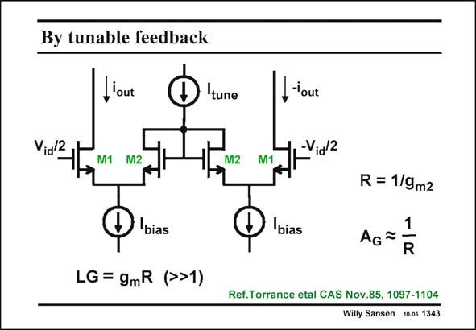

# SANSEN-1343 · By tunable feedback

章节：13 反馈电压放大器与跨导放大器  
PDF 页：377；书本页：384；幻灯片编号：1343  
状态：unreviewed



## 对应教材讲解

### PDF 377 · 书本 384

The feedback resistors can be made tunable by replacing them by forward biased diode-connected transistors M2, as shown in this slide. Each transistor M2 carries a DC current I /2. It tune acts as a feedback resistor for transistor M1 with value 1/g . m2 The transconductance can now be set by setting current I . This current tune must always be larger than 2I however. bias

## 公式／性能结论候选摘录

以下为规则截取的原文，尚未逐项判读。

（未由规则找到；不代表原页没有此类内容。）

## 曲线结论候选摘录

以下为规则截取的原文，尚未逐项判读。

（未由规则找到；不代表原页没有此类内容。）

## 原文条件与近似候选摘录

以下为规则截取的原文，尚未逐项判读。

（未由规则找到；不代表原页没有此类内容。）

## 幻灯片 OCR（未校正）

```text
By tunable feedback
l'out
tune
Vidz,
I-out
-Vid/2
M1 M2
M2 M1
bias
LG = gmR (>>1)
bias
R = 1/9m2
AG=
1|
R
Ref.Torrance etal CAS Nov.85, 1097-1104
Willy Sansen 10 0s 1343
```

数学上下标、分数及正负号以原图为准。电路图已保留；未核对的连接不输出成可仿真 netlist。
