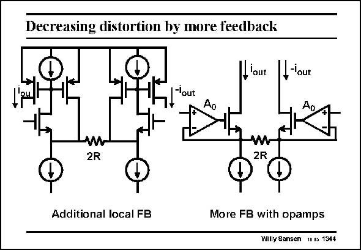

# SANSEN-1344 · Decreasing distortion by more feedback

章节：13 反馈电压放大器与跨导放大器  
PDF 页：378；书本页：385；幻灯片编号：1344  
状态：unreviewed



## 对应教材讲解

### PDF 378 · 书本 385

More loop gain can be obtained by insertion of more transistors in the feedback loop. On the left, only one more transistor is included in the feedback loop. Moreover, this configuration allows an elegant way to take the output currents. Indeed, the additional transistors form current mirrors with the output transistors. Even more loop gain is available if full opamps are inserted in the feedback loops as shown on the right. This is clearly the most accurate way to convert a differential input voltage into a differential output current. At high frequencies, however, the opamp does not provide all that much gain. At high frequencies the left circuit is now preferred, although it is less accurate.

## 公式／性能结论候选摘录

以下为规则截取的原文，尚未逐项判读。

- PDF 378: More loop gain can be obtained by insertion of more transistors in the feedback loop.
- PDF 378: Even more loop gain is available if full opamps are inserted in the feedback loops as shown on the right.
- PDF 378: At high frequencies, however, the opamp does not provide all that much gain.

## 曲线结论候选摘录

以下为规则截取的原文，尚未逐项判读。

（未由规则找到；不代表原页没有此类内容。）

## 原文条件与近似候选摘录

以下为规则截取的原文，尚未逐项判读。

（未由规则找到；不代表原页没有此类内容。）

## 幻灯片 OCR（未校正）

```text
Decreasing distortion by more feedback
lout
_'out
-lout
w
2R
2R
Additional local FB
More FB with opamps
Willy Sansen uus 1344
```

数学上下标、分数及正负号以原图为准。电路图已保留；未核对的连接不输出成可仿真 netlist。
