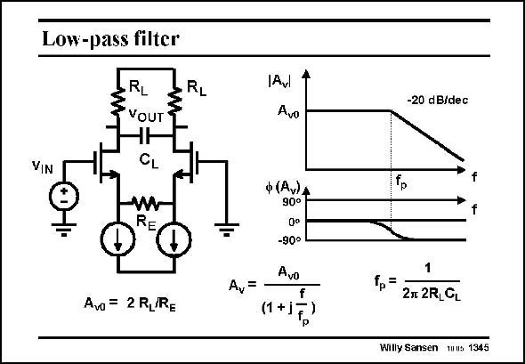

# SANSEN-1345 · Low-pass filter

章节：13 反馈电压放大器与跨导放大器  
PDF 页：378；书本页：385；幻灯片编号：1345  
状态：unreviewed



## 对应教材讲解

### PDF 378 · 书本 385

Such a single-transistor transconductor is easily modified to make a low-pass filter. A capacitor C is L connected between the differential outputs. In this way a first-order pole is obtained with frequency f , which creates p a −20 dB/decade roll-off starting at the pole frequency.

## 公式／性能结论候选摘录

以下为规则截取的原文，尚未逐项判读。

（未由规则找到；不代表原页没有此类内容。）

## 曲线结论候选摘录

以下为规则截取的原文，尚未逐项判读。

- PDF 378: In this way a first-order pole is obtained with frequency f , which creates p a −20 dB/decade roll-off starting at the pole frequency.

## 原文条件与近似候选摘录

以下为规则截取的原文，尚未逐项判读。

（未由规则找到；不代表原页没有此类内容。）

## 幻灯片 OCR（未校正）

```text
VIN
Low-pass filter
RL
VOUT
CL
RL
Avl
Avo
RE
Ava = 2 RLRE
ф (Av)А
90°
-90°
Avo
Av=
f
(1*1F,)
-20 dB/dec
=
2n 2R,GL
Willy Sansen muus 1345
```

数学上下标、分数及正负号以原图为准。电路图已保留；未核对的连接不输出成可仿真 netlist。
