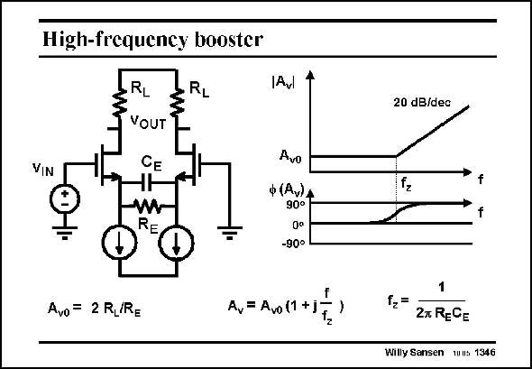

# SANSEN-1346 · High-frequency booster

章节：13 反馈电压放大器与跨导放大器  
PDF 页：379；书本页：386；幻灯片编号：1346  
状态：unreviewed



## 对应教材讲解

### PDF 379 · 书本 386

In a similar way, a firstorder zero can be created, by putting a capacitor C in E parallel with the resistor R . E The characteristic frequency is now f . At this frequency, z the gain starts going up with a slope of 20 dB/decade.

## 公式／性能结论候选摘录

以下为规则截取的原文，尚未逐项判读。

- PDF 379: At this frequency, z the gain starts going up with a slope of 20 dB/decade.

## 曲线结论候选摘录

以下为规则截取的原文，尚未逐项判读。

- PDF 379: E The characteristic frequency is now f .
- PDF 379: At this frequency, z the gain starts going up with a slope of 20 dB/decade.

## 原文条件与近似候选摘录

以下为规则截取的原文，尚未逐项判读。

（未由规则找到；不代表原页没有此类内容。）

## 幻灯片 OCR（未校正）

```text
High-frequency booster
VIN
RL
VOUT
CE
W
RE
RL
Avl
Avo = 2 R,/RE
A=AOl1+T)
20 dB/dec
Avo
ф (Av)A
90°
-90°
f2=
27 RECE
Willy Sansen 1uus 1346
```

数学上下标、分数及正负号以原图为准。电路图已保留；未核对的连接不输出成可仿真 netlist。
