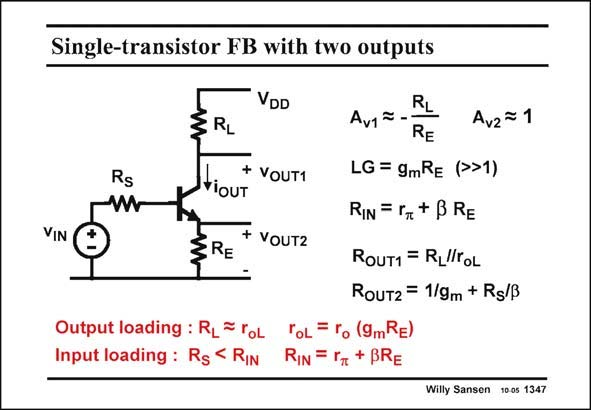

# SANSEN-1347 · Single-transistor FB with two outputs

章节：13 反馈电压放大器与跨导放大器  
PDF 页：379；书本页：386；幻灯片编号：1347  
状态：unreviewed



## 对应教材讲解

### PDF 379 · 书本 386

The single-transistor amplifier with local feedback can also provide two outputs as shown in this slide. The output at the Collector provides nonideal series-series feedback as discussed in this slide. The output at the Emitter, however, is the output of an Emitter follower. Its gain A is unity and its output v2 resistance R is small. OUT2 Emitter and Source followers do use feedback. They provide an accurate voltage gain, which is closer to unity the larger the loop gain is. They also provide a reduced output resistance. Clearly, all this applies to a MOST single-transistor amplifier with local feedback. The gain at the Source is unity again, at least if the bulk effect does not come in. The output resistance is the same as for a bipolar transistor with infinite beta. It is simply 1/g . m

## 公式／性能结论候选摘录

以下为规则截取的原文，尚未逐项判读。

- PDF 379: Its gain A is unity and its output v2 resistance R is small.
- PDF 379: They provide an accurate voltage gain, which is closer to unity the larger the loop gain is.
- PDF 379: The gain at the Source is unity again, at least if the bulk effect does not come in.

## 曲线结论候选摘录

以下为规则截取的原文，尚未逐项判读。

（未由规则找到；不代表原页没有此类内容。）

## 原文条件与近似候选摘录

以下为规则截取的原文，尚未逐项判读。

（未由规则找到；不代表原页没有此类内容。）

## 幻灯片 OCR（未校正）

```text
Single-transistor FB with two outputs
DD
VIN
Rs
W
RL
+ VOUT1
VIOUT
§RE
+ VoUT2
RL
Av1ã
RE
LG = gmRe (>>1)
RIN = rR+ BRE
Av2 = 1
ROUT1 = RLlroL
Rout2 = 1/gm + Rg/B
Output loading: R_ = roL
ToL = ro (9mRE)
Input loading: Rs < Rin
RIN = TT + BRE
Willy Sansen 10 os 1347
```

数学上下标、分数及正负号以原图为准。电路图已保留；未核对的连接不输出成可仿真 netlist。
