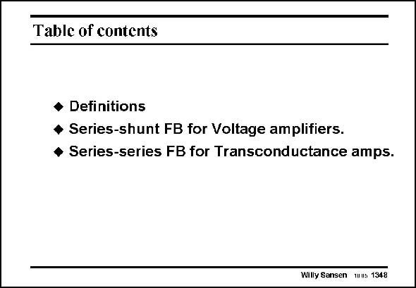

# SANSEN-1348 · Table of contents

章节：13 反馈电压放大器与跨导放大器  
PDF 页：380；书本页：387；幻灯片编号：1348  
状态：unreviewed



## 对应教材讲解

### PDF 380 · 书本 387

In this Chapter the four types of feedback have been introduced and compared. Both types of series feedback at the input have been discussed in detail. For a number of circuit realizations the expressions of the loop gain, input and output impedance have been derived. In the following Chapter, the focus is on circuits with shunt feedback at the input.

## 公式／性能结论候选摘录

以下为规则截取的原文，尚未逐项判读。

- PDF 380: For a number of circuit realizations the expressions of the loop gain, input and output impedance have been derived.

## 曲线结论候选摘录

以下为规则截取的原文，尚未逐项判读。

（未由规则找到；不代表原页没有此类内容。）

## 原文条件与近似候选摘录

以下为规则截取的原文，尚未逐项判读。

（未由规则找到；不代表原页没有此类内容。）

## 幻灯片 OCR（未校正）

```text
Table of contents
• Definitions
• Series-shunt FB for Voltage amplifiers.
• Series-series FB for Transconductance amps.
Willy Sansen mus 1348
```

数学上下标、分数及正负号以原图为准。电路图已保留；未核对的连接不输出成可仿真 netlist。
