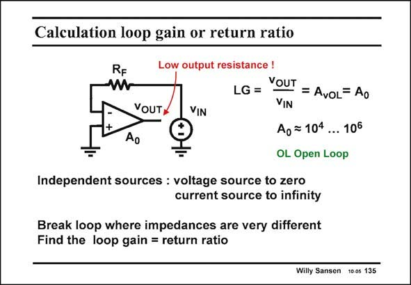

# SANSEN-135 · Calculation loop gain or return ratio

章节：13 反馈电压放大器与跨导放大器  
PDF 页：358；书本页：365；幻灯片编号：135  
状态：unreviewed



## 对应教材讲解

### PDF 358 · 书本 365

It is clear that the loop gain LG is the most important characteristic of a feedback amplifier. Therefore, its value must be calculated first. The loop gain LG is calculated by breaking the loop and by calculating the gain, going around the loop. The DC conditions must be maintained, only the AC loop is broken. Ideally it makes no difference where the loop is broken. The loop gain should be independent of where the loop is broken. Therefore, we try to find an easy place, a place where the calculations are easy. This is the case for any connection where the difference between the resistance, left and right are the largest. In the example in this slide, the output resistance of the operational amplifier is quite low, certainly a lot lower than resistor R . Therefore, we break in between. We apply a voltage source F (as the output resistance of the opamp was low) and we calculate the voltage going around the loop. This gives a value A . However, the voltage on both sides of the resistor R are the same 0 F as there is no current flowing through it. What happened to the input current source? Since we have applied another input source v , IN we must remove the input current source (called the independent source). For calculating the loop gain, we replace an independent current source by its internal resistance (which is infinity). Independent voltage sources are replaced by their internal resistance as well, which is just about zero or a short-circuit.

## 公式／性能结论候选摘录

以下为规则截取的原文，尚未逐项判读。

- PDF 358: It is clear that the loop gain LG is the most important characteristic of a feedback amplifier.
- PDF 358: Therefore, its value must be calculated first.
- PDF 358: The loop gain LG is calculated by breaking the loop and by calculating the gain, going around the loop.
- PDF 358: The loop gain should be independent of where the loop is broken.
- PDF 358: Therefore, we try to find an easy place, a place where the calculations are easy.
- PDF 358: Therefore, we break in between.
- PDF 358: Since we have applied another input source v , IN we must remove the input current source (called the independent source).
- PDF 358: For calculating the loop gain, we replace an independent current source by its internal resistance (which is infinity).

## 曲线结论候选摘录

以下为规则截取的原文，尚未逐项判读。

- PDF 358: It is clear that the loop gain LG is the most important characteristic of a feedback amplifier.

## 原文条件与近似候选摘录

以下为规则截取的原文，尚未逐项判读。

（未由规则找到；不代表原页没有此类内容。）

## 幻灯片 OCR（未校正）

```text
Calculation loop gain or return ratio
RF
W
VOUTY
Ao
Low output resistance !
YouT
LG =
=AvoL= Ao
VIN
VIN
Ao =104 ... 106
OL Open Loop
Independent sources : voltage source to zero
current source to infinity
Break loop where impedances are very different
Find the loop gain = return ratio
Willy Sansen 10 0s 135
```

数学上下标、分数及正负号以原图为准。电路图已保留；未核对的连接不输出成可仿真 netlist。
