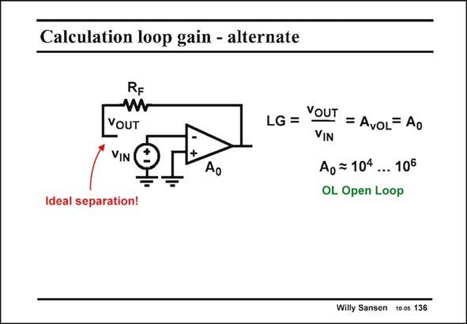

# SANSEN-136 · Calculation loop gain - alternate

章节：13 反馈电压放大器与跨导放大器  
PDF 页：359；书本页：366；幻灯片编号：136  
状态：unreviewed



## 对应教材讲解

### PDF 359 · 书本 366

The gain calculated in this way is therefore the loop gain LG or also called the return ratio. To illustrate that it does not make any difference where the loop is broken, we calculate the loop gain LG again. This time the loop is broken between the feedback resistor R and F the input terminal of the opamp. This is an even better place than before as the input resistance of an opamp is just about infinity, and a lot larger than that resistor R . F It is clear that we find the same value of the loop gain LG. It is again equal to the gain of the operational amplifier itself A . 0

## 公式／性能结论候选摘录

以下为规则截取的原文，尚未逐项判读。

- PDF 359: The gain calculated in this way is therefore the loop gain LG or also called the return ratio.
- PDF 359: To illustrate that it does not make any difference where the loop is broken, we calculate the loop gain LG again.
- PDF 359: F It is clear that we find the same value of the loop gain LG.
- PDF 359: It is again equal to the gain of the operational amplifier itself A . 0

## 曲线结论候选摘录

以下为规则截取的原文，尚未逐项判读。

（未由规则找到；不代表原页没有此类内容。）

## 原文条件与近似候选摘录

以下为规则截取的原文，尚未逐项判读。

（未由规则找到；不代表原页没有此类内容。）

## 幻灯片 OCR（未校正）

```text
Calculation loop gain - alternate
RF
YOUT
VIN
Ideal separation!
Ao
LG = YOUT = AvoL= Ao
Ao = 104.
... 106
OL Open Loop
Willy Sansen 10 os 136
```

数学上下标、分数及正负号以原图为准。电路图已保留；未核对的连接不输出成可仿真 netlist。
