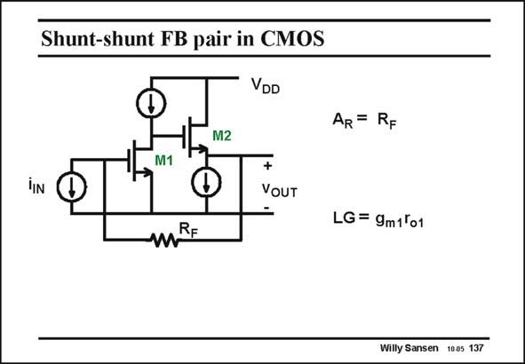

# SANSEN-137 · Shunt-shunt FB pair in CMOS

章节：13 反馈电压放大器与跨导放大器  
PDF 页：359；书本页：366；幻灯片编号：137  
状态：unreviewed



## 对应教材讲解

### PDF 359 · 书本 366

The amplifier does not need to be a full operational amplifier, with lots of gain. A simple transistor amplifier can do it as well. Here the opamp is replaced by a single-stage amplifier followed by a source follower. The open-loop gain is simply the gain of that input transistor as a source follower provides a gain of unity only. This is also the loop gain as easily seen. We can still break the loop where we want. The output resistance is a bit higher now, i.e. 1/g , which is still a lot smaller than R . m2 F The closed-loop gain is usually the easiest one to calculate. It is still R as for the first feedback F amplifier and it is still a transresistance amplifier. In other words, it converts an input current into an output voltage with high accuracy, here with value R . F

## 公式／性能结论候选摘录

以下为规则截取的原文，尚未逐项判读。

- PDF 359: The amplifier does not need to be a full operational amplifier, with lots of gain.
- PDF 359: The open-loop gain is simply the gain of that input transistor as a source follower provides a gain of unity only.
- PDF 359: This is also the loop gain as easily seen.
- PDF 359: The output resistance is a bit higher now, i.e. 1/g , which is still a lot smaller than R . m2 F The closed-loop gain is usually the easiest one to calculate.

## 曲线结论候选摘录

以下为规则截取的原文，尚未逐项判读。

（未由规则找到；不代表原页没有此类内容。）

## 原文条件与近似候选摘录

以下为规则截取的原文，尚未逐项判读。

（未由规则找到；不代表原页没有此类内容。）

## 幻灯片 OCR（未校正）

```text
Shunt-shunt FB pair in CMOS
VDD
AR = RF
M2
M1
+
VOUT
MRE
LG = 9m1ºo1
Willy Sansen 1005 137
```

数学上下标、分数及正负号以原图为准。电路图已保留；未核对的连接不输出成可仿真 netlist。
