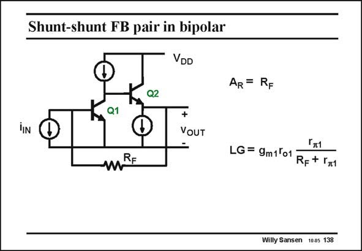

# SANSEN-138 · Shunt-shunt FB pair in bipolar

章节：13 反馈电压放大器与跨导放大器  
PDF 页：360；书本页：367；幻灯片编号：138  
状态：unreviewed



## 对应教材讲解

### PDF 360 · 书本 367

Using bipolar transistors instead of MOSTs changes the input resistance considerably. Now that the input resistance of the bipolar transistor is only r , p instead of infinity for a MOST. As a result, the loop gain will no longer be the same as the feedback resistor may be comparable to that resistance r . p The closed-loop gain is still the same however, i.e. R . F To calculate the loop gain LG we can break the loop between the emitter of transistor Q2 and resistor R as we did before. F There is a better place however, as shown next.

## 公式／性能结论候选摘录

以下为规则截取的原文，尚未逐项判读。

- PDF 360: As a result, the loop gain will no longer be the same as the feedback resistor may be comparable to that resistance r . p The closed-loop gain is still the same however, i.e.
- PDF 360: F To calculate the loop gain LG we can break the loop between the emitter of transistor Q2 and resistor R as we did before.

## 曲线结论候选摘录

以下为规则截取的原文，尚未逐项判读。

（未由规则找到；不代表原页没有此类内容。）

## 原文条件与近似候选摘录

以下为规则截取的原文，尚未逐项判读。

（未由规则找到；不代表原页没有此类内容。）

## 幻灯片 OCR（未校正）

```text
Shunt-shunt FB pair in bipolar
VDD
Ka1
K,02
MRE
AR = RF
+
VOUT
Гт1
LG = 9m1ºo1
RF+ r71
Willy Sansen 1005 138
```

数学上下标、分数及正负号以原图为准。电路图已保留；未核对的连接不输出成可仿真 netlist。
