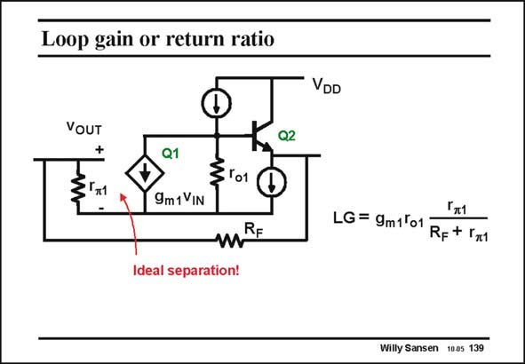

# SANSEN-139 · Loop gain or return ratio

章节：13 反馈电压放大器与跨导放大器  
PDF 页：360；书本页：367；幻灯片编号：139  
状态：unreviewed



## 对应教材讲解

### PDF 360 · 书本 367

To find this better place to break the loop, we have to draw the small-signal schematic. Now it becomes clear that right in between the base terminal of transistor Q1 and its voltage-controlled current source is an excellent place to break the loop. We therefore exploit the fact that the input resistor r of transistor Q1 is p1 physically separated from the current source g v in m1 IN the small-signal equivalent circuit. They are only linked by means of an equation which only provides a non-physical connection. The loop-gain is then readily calculated. It shows that at the input, we find a resistive divider of r with R , which reduces the loop gain somewhat. p1 F

## 公式／性能结论候选摘录

以下为规则截取的原文，尚未逐项判读。

- PDF 360: We therefore exploit the fact that the input resistor r of transistor Q1 is p1 physically separated from the current source g v in m1 IN the small-signal equivalent circuit.
- PDF 360: The loop-gain is then readily calculated.
- PDF 360: It shows that at the input, we find a resistive divider of r with R , which reduces the loop gain somewhat. p1 F

## 曲线结论候选摘录

以下为规则截取的原文，尚未逐项判读。

（未由规则找到；不代表原页没有此类内容。）

## 原文条件与近似候选摘录

以下为规则截取的原文，尚未逐项判读。

（未由规则找到；不代表原页没有此类内容。）

## 幻灯片 OCR（未校正）

```text
Loop gain or return ratio
VOUT
+
Q2
-
Q1
+
To1
9m 1 VIN
mRE
Ideal separation!
VDD
Гт1
LG = 9m1ºo1
Rg + 11
Willy Sansen 1005 139
```

数学上下标、分数及正负号以原图为准。电路图已保留；未核对的连接不输出成可仿真 netlist。
