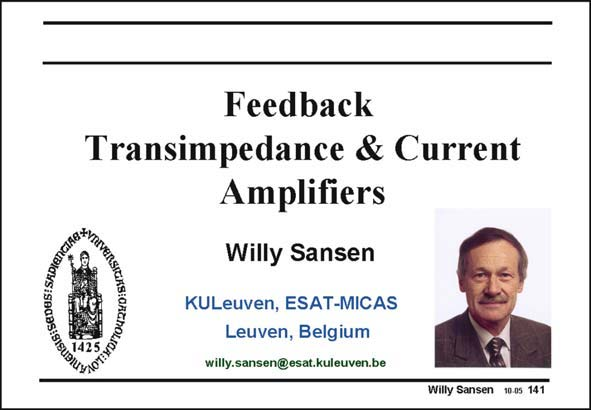

# SANSEN-141 · Slide 141

章节：14 反馈跨阻放大器与电流放大器  
PDF 页：381；书本页：389；幻灯片编号：141  
状态：unreviewed



## 对应教材讲解

### PDF 381 · 书本 389

An introduction on feedback has been given in the previous Chapter design. The four basic types of feedback have been identified. Two of them have been discussed in the previous Chapter. They are the types with series feedback at the input as they measure a voltage. In this Chapter, we will focus on the two other types of feedback, i.e. the ones with shunt feedback at the input. As a consequence, they measure an input current. They are therefore transimpedance amplifiers, if an output voltage is provided, or current amplifiers.

## 公式／性能结论候选摘录

以下为规则截取的原文，尚未逐项判读。

- PDF 381: They are therefore transimpedance amplifiers, if an output voltage is provided, or current amplifiers.

## 曲线结论候选摘录

以下为规则截取的原文，尚未逐项判读。

（未由规则找到；不代表原页没有此类内容。）

## 原文条件与近似候选摘录

以下为规则截取的原文，尚未逐项判读。

- PDF 381: They are therefore transimpedance amplifiers, if an output voltage is provided, or current amplifiers.

## 幻灯片 OCR（未校正）

```text
Feedback
Transimpedance & Current
Amplifiers
Willy Sansen
KULeuven, ESAT-MICAS
Leuven, Belgium
willy.sansen@esat.kuleuven.be
Willy Sansen 10.0s 141
```

数学上下标、分数及正负号以原图为准。电路图已保留；未核对的连接不输出成可仿真 netlist。
