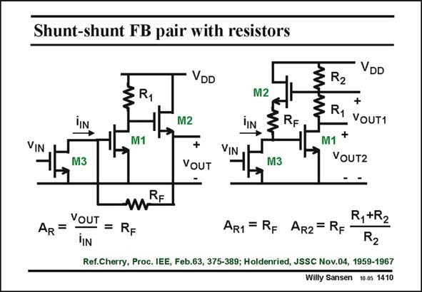

# SANSEN-1410 · Shunt-shunt FB pair with resistors

章节：14 反馈跨阻放大器与电流放大器  
PDF 页：385；书本页：393；幻灯片编号：1410  
状态：unreviewed



## 对应教材讲解

### PDF 385 · 书本 393

Resistors can be used instead of the current sources as well. Moreover, the input current source can be substituted by a MOST, which is M3 in the examples in this slide. In addition, the DC current source of the source follower M2 can now be left out. The DC current through M2 is the same as the DC current through input transistor M3. In this case, the transresistance A is again R . The R F voltage gain v /v is OUT IN then g R . m3 F In the example on the right, the output v is now taken at the Gate of the source follower OUT1 M2, rather than at its Source. The transresistance A is again R . The loop gain is the same as R1 F in the example on the left but the output resistance will be higher. Another output can be taken, when another resistor R is added, as shown in the example on 1 the right. In this case the gain is increased by a ratio (R +R )/R . 1 2 2 However, both circuits are variations on the theme of shunt-shunt feedback pairs. These variations are mainly used to realize wide-band amplifiers, up to several GHz’s.

## 公式／性能结论候选摘录

以下为规则截取的原文，尚未逐项判读。

- PDF 385: The R F voltage gain v /v is OUT IN then g R . m3 F In the example on the right, the output v is now taken at the Gate of the source follower OUT1 M2, rather than at its Source.
- PDF 385: The loop gain is the same as R1 F in the example on the left but the output resistance will be higher.
- PDF 385: In this case the gain is increased by a ratio (R +R )/R . 1 2 2 However, both circuits are variations on the theme of shunt-shunt feedback pairs.

## 曲线结论候选摘录

以下为规则截取的原文，尚未逐项判读。

（未由规则找到；不代表原页没有此类内容。）

## 原文条件与近似候选摘录

以下为规则截取的原文，尚未逐项判读。

（未由规则找到；不代表原页没有此类内容。）

## 幻灯片 OCR（未校正）

```text
Shunt-shunt FB pair with resistors
§R,
IIN
VIN
M1
M3
mRE
AR =
VOUT = RF
VDD
M2
M2
iN
SRF
+
VOUT
VIN
M3
VDD
ZR1 VOUTI
M1 +
VOUT2
-
AR1 = RF AR2 = RF
R,+R2
R2
Ref.Cherry, Proc. IEE, Feb.63, 375-389; Holdenried, JSSC Nov.04, 1959-1967
Willy Sansen 10.05 1410
```

数学上下标、分数及正负号以原图为准。电路图已保留；未核对的连接不输出成可仿真 netlist。
