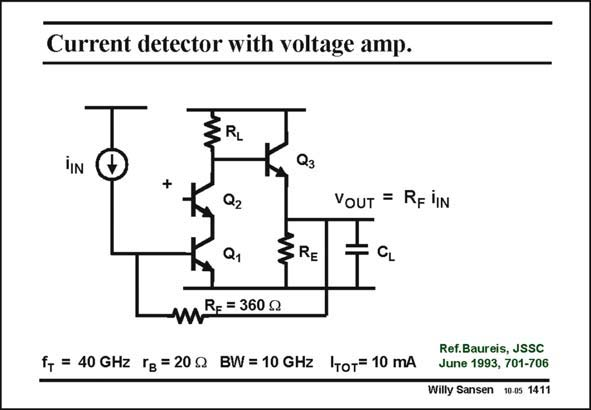

# SANSEN-1411 · Current detector with voltage amp.

章节：14 反馈跨阻放大器与电流放大器  
PDF 页：386；书本页：394；幻灯片编号：1411  
状态：unreviewed



## 对应教材讲解

### PDF 386 · 书本 394

A real-life example of such a shunt-shunt feedback amplifier has been published in the IEEE Journal of Solid- State Circuits. Its transresistance is quite small, only 360 V. Its bandwidth, however, is impressive, i.e. 10 GHz. The gain itself is again given by a single-transistor amplifier, with a cascode however, to increase the gain, and to isolate its output better from the input. Again an emitter follower is used to lower the output resistance. All calculations apply again. The output resistance R will again be very small. This is why O the bandwidth is so high, even with a fairly large load capacitor C . It is simply given by L 1/(2pR C ). O L The open loop output resistance is the parallel combination of three resistances, i.e. R +r , F p1 R and 1/g +R /b . Altogether, this is about 1/g . The closed loop output resistance R is E m3 L 3 m3 O then the open loop one divided by the loop gain.

## 公式／性能结论候选摘录

以下为规则截取的原文，尚未逐项判读。

- PDF 386: Its bandwidth, however, is impressive, i.e. 10 GHz.
- PDF 386: The gain itself is again given by a single-transistor amplifier, with a cascode however, to increase the gain, and to isolate its output better from the input.
- PDF 386: This is why O the bandwidth is so high, even with a fairly large load capacitor C .
- PDF 386: The closed loop output resistance R is E m3 L 3 m3 O then the open loop one divided by the loop gain.

## 曲线结论候选摘录

以下为规则截取的原文，尚未逐项判读。

（未由规则找到；不代表原页没有此类内容。）

## 原文条件与近似候选摘录

以下为规则截取的原文，尚未逐项判读。

（未由规则找到；不代表原页没有此类内容。）

## 幻灯片 OCR（未校正）

```text
Current detector with voltage amp.
Đ
ERL
Q3
+
Q2
VOUT = RF IN
Q1
§RE
mR= = 360 g
f, = 40 GHz Гg =20g BW= 10 GHz IToT= 10 mA
Ref.Baureis, JSSC
June 1993, 701-706
Willy Sansen 10.0$ 1411
```

数学上下标、分数及正负号以原图为准。电路图已保留；未核对的连接不输出成可仿真 netlist。
