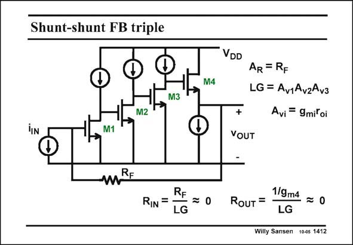

# SANSEN-1412 · Shunt-shunt FB triple

章节：14 反馈跨阻放大器与电流放大器  
PDF 页：386；书本页：394；幻灯片编号：1412  
状态：unreviewed



## 对应教材讲解

### PDF 386 · 书本 394

In we want to make sure that the feedback is negative, shunt-shunt feedback is only possible either around one single transistor or around three transistors. Indeed each gain transistor inverts the polarity. A single-gain stage suffers from too small gain, causing too low a loop gain. A triple-gain stage provides a lot more loop gain and is much closer to an ideal feedback amplifier. The gain per stage is simply g r . m o As a result, both the input and output resistances will be quite small. The current-to-voltage (closed-loop) gain is again R , as expected. F

## 公式／性能结论候选摘录

以下为规则截取的原文，尚未逐项判读。

- PDF 386: Indeed each gain transistor inverts the polarity.
- PDF 386: A single-gain stage suffers from too small gain, causing too low a loop gain.
- PDF 386: A triple-gain stage provides a lot more loop gain and is much closer to an ideal feedback amplifier.
- PDF 386: The gain per stage is simply g r . m o As a result, both the input and output resistances will be quite small.
- PDF 386: The current-to-voltage (closed-loop) gain is again R , as expected.

## 曲线结论候选摘录

以下为规则截取的原文，尚未逐项判读。

（未由规则找到；不代表原页没有此类内容。）

## 原文条件与近似候选摘录

以下为规则截取的原文，尚未逐项判读。

（未由规则找到；不代表原页没有此类内容。）

## 幻灯片 OCR（未校正）

```text
Shunt-shunt FB triple
M3
M2
M1
mRE
RF
RIN =
LG
VDD
M4
AR = RF
LG = AviAvzAv3
Avi = 9mitoi
+
VOUT
RouT =
1/9m4
LG
—=0
Willy Sansen 10-05 1412
```

数学上下标、分数及正负号以原图为准。电路图已保留；未核对的连接不输出成可仿真 netlist。
