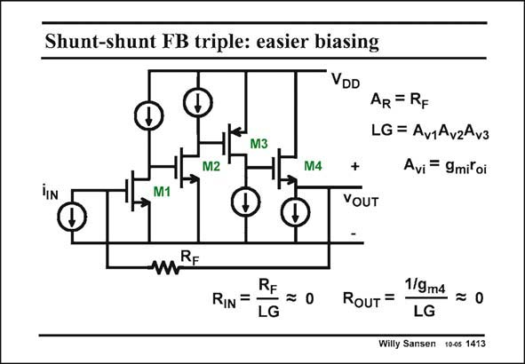

# SANSEN-1413 · Shunt-shunt FB triple: easier biasing

章节：14 反馈跨阻放大器与电流放大器  
PDF 页：387；书本页：395；幻灯片编号：1413  
状态：unreviewed



## 对应教材讲解

### PDF 387 · 书本 395

For biasing, or DC setting of the currents, it may be easier to introduce a pMOST as the second or third stage or even as a source follower. In the example in this slide, it is the third stage which is using a pMOST amplifier. Obviously the expressions for input and output impedance do not change. The biasing is easier however. Indeed the DC input voltage is about 1 V above ground, and so is the DC output voltage. The other DC voltages are now easily found, depending on the transistor sizes and V values chosen. GS

## 公式／性能结论候选摘录

以下为规则截取的原文，尚未逐项判读。

- PDF 387: The other DC voltages are now easily found, depending on the transistor sizes and V values chosen.

## 曲线结论候选摘录

以下为规则截取的原文，尚未逐项判读。

（未由规则找到；不代表原页没有此类内容。）

## 原文条件与近似候选摘录

以下为规则截取的原文，尚未逐项判读。

（未由规则找到；不代表原页没有此类内容。）

## 幻灯片 OCR（未校正）

```text
Shunt-shunt FB triple: easier biasing
VDD
M3
M2
M4
AR = RF
LG = Av1Av2Av3
Avi = 9mitoi
M1
+
VOUT
mRE
RF
RIN =
LG
RouT =
1/9m4
LG
—=0
Willy Sansen 10-05 1413
```

数学上下标、分数及正负号以原图为准。电路图已保留；未核对的连接不输出成可仿真 netlist。
