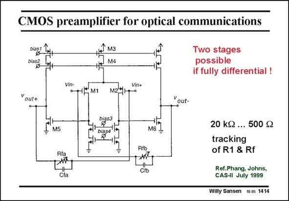

# SANSEN-1414 · CMOS preamplifier for optical communications

章节：14 反馈跨阻放大器与电流放大器  
PDF 页：387；书本页：395；幻灯片编号：1414  
状态：unreviewed



## 对应教材讲解

### PDF 387 · 书本 395

It is possible to apply negative feedback around a twostage amplifier provided differential pairs are used. Both feedback connections provide negative feedback, yielding a transresistance of R , as before. F The advantage of using only two stages is that there are less non-dominant poles so that stability and peaking problems are avoided. Moreover, both inputs and outputs are differential, increasing specifications such as CMRR and PSRR considerably. The CMRR is the common-mode rejection ratio. It indicates how much less common-mode disturbances in the ground (noise, spikes) are amplified to the output, than the differential input signal. The PSRR then indicates how much less disturbances on the power supply line are amplified to the output, compared to the input signal. A published realization of this fully-differential two-stage feedback amplifier is shown in this slide. The differential gain is set by R . The global bandwidth is then set by capacitance C . f f Two stages always require an internal compensation capacitance, which here is C . It acts as f a Miller capacitance. It provides pole splitting to ensure that the second pole is beyond the GBW.

## 公式／性能结论候选摘录

以下为规则截取的原文，尚未逐项判读。

- PDF 387: The differential gain is set by R .
- PDF 387: The global bandwidth is then set by capacitance C . f f Two stages always require an internal compensation capacitance, which here is C .

## 曲线结论候选摘录

以下为规则截取的原文，尚未逐项判读。

- PDF 387: F The advantage of using only two stages is that there are less non-dominant poles so that stability and peaking problems are avoided.

## 原文条件与近似候选摘录

以下为规则截取的原文，尚未逐项判读。

- PDF 387: It is possible to apply negative feedback around a twostage amplifier provided differential pairs are used.

## 幻灯片 OCR（未校正）

```text
CMOS preamplifier for optical communications
Dias1
bias?
J мз
M4
Two stages
possible
if fully differential !
Vin-
*M1
Vin+
M27
Yout+
Yout-
M5
Diasa
M6
Rib
AV-
cfa
20 kJ ... 500 g
tracking
of R1 & Rf
Ref.Phang, Johns,
CAS-Il July 1999
Willy Sansen 10.0s 1414
```

数学上下标、分数及正负号以原图为准。电路图已保留；未核对的连接不输出成可仿真 netlist。
