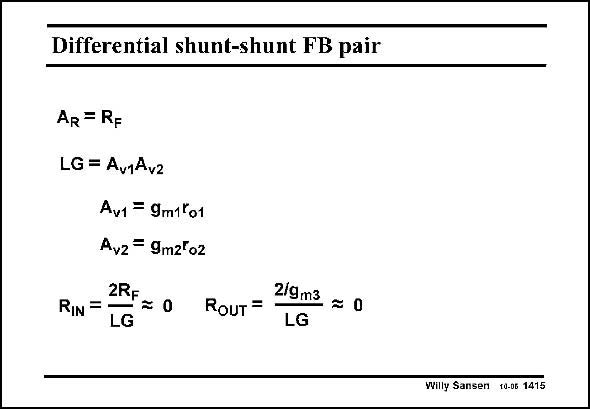

# SANSEN-1415 · Differential shunt-shunt FB pair

章节：14 反馈跨阻放大器与电流放大器  
PDF 页：388；书本页：396；幻灯片编号：1415  
状态：unreviewed



## 对应教材讲解

### PDF 388 · 书本 396

The problem with such fully-differential amplifiers (i.e. two inputs and two outputs) are the factors of two appearing in the gain. Is the transresistance R or 2R ? F F How about the differential input and output impedance? This amplifier has two input current sources both with value i . The differ- IN ential output voltage will thus be 2R i . The trans- F IN resistance is simply R . F The loop gain equals the gains of the two transistor stages. The differential input impedance will now be 2R divided by F the loop gain. This also applies to the output resistance.

## 公式／性能结论候选摘录

以下为规则截取的原文，尚未逐项判读。

- PDF 388: The problem with such fully-differential amplifiers (i.e. two inputs and two outputs) are the factors of two appearing in the gain.
- PDF 388: The differ- IN ential output voltage will thus be 2R i .
- PDF 388: F The loop gain equals the gains of the two transistor stages.
- PDF 388: The differential input impedance will now be 2R divided by F the loop gain.

## 曲线结论候选摘录

以下为规则截取的原文，尚未逐项判读。

（未由规则找到；不代表原页没有此类内容。）

## 原文条件与近似候选摘录

以下为规则截取的原文，尚未逐项判读。

（未由规则找到；不代表原页没有此类内容。）

## 幻灯片 OCR（未校正）

```text
Differential shunt-shunt FB pair
AR = RF
LG = Av1Av2
Av1 = 9m1k01
Avz= 9m2°o2
RIN =
2RF = 0
LG
RouT =
2/9m3
= 0
LG
Willy Sansen 10.06 1415
```

数学上下标、分数及正负号以原图为准。电路图已保留；未核对的连接不输出成可仿真 netlist。
