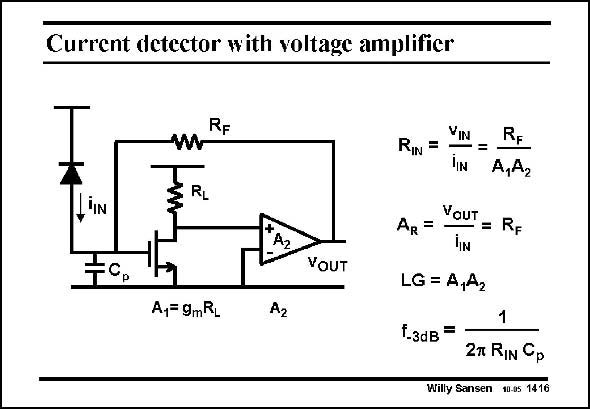

# SANSEN-1416 · Current detector with voltage amplifier

章节：14 反馈跨阻放大器与电流放大器  
PDF 页：388；书本页：396；幻灯片编号：1416  
状态：unreviewed



## 对应教材讲解

### PDF 388 · 书本 396

This transimpedance amplifier is usually the first stage of an optical fiber receiver. The photodiode behaves as a current source when it is exposed to light. This current is then multiplied by R F to generate an output voltage. The first amplifier stage is shown in detail. Its gain is A . The subsequent 1 stages, however, are included in the (triangular) black box with gain A . The 2 total loop gain LG is simply A A . 1 2 The input resistance R is reduced by this loop gain, as expected. As a result, the diode IN capacitance and the parasitic capacitances C at the input of the amplifier, caused by interconnect p and the transistor input capacitance, only see a small input resistance R /A A . The bandwidth F 1 2 or f can now be exceedingly high, to achieve a high bit rate. −3dB

## 公式／性能结论候选摘录

以下为规则截取的原文，尚未逐项判读。

- PDF 388: Its gain is A .
- PDF 388: The subsequent 1 stages, however, are included in the (triangular) black box with gain A .
- PDF 388: The 2 total loop gain LG is simply A A . 1 2 The input resistance R is reduced by this loop gain, as expected.
- PDF 388: As a result, the diode IN capacitance and the parasitic capacitances C at the input of the amplifier, caused by interconnect p and the transistor input capacitance, only see a small input resistance R /A A .
- PDF 388: The bandwidth F 1 2 or f can now be exceedingly high, to achieve a high bit rate. −3dB

## 曲线结论候选摘录

以下为规则截取的原文，尚未逐项判读。

（未由规则找到；不代表原页没有此类内容。）

## 原文条件与近似候选摘录

以下为规则截取的原文，尚未逐项判读。

（未由规则找到；不代表原页没有此类内容。）

## 幻灯片 OCR（未校正）

```text
Current detector with voltage amplifier
wRF
RL
A2
FC.
VOUT
A1= 9mRL
VIN
RIN =
-=
RE
A,A2
VouT
AR =
= RF
LG = A,A2
1
f.зdB = 27 RIN Gp
Willy Sansen 10.05 1416
```

数学上下标、分数及正负号以原图为准。电路图已保留；未核对的连接不输出成可仿真 netlist。
