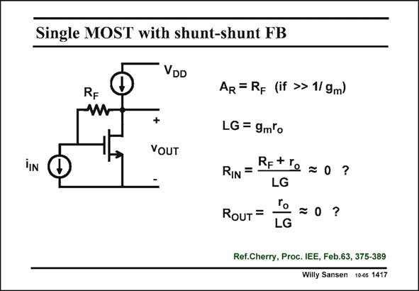

# SANSEN-1417 · Single MOST with shunt-shunt FB

章节：14 反馈跨阻放大器与电流放大器  
PDF 页：389；书本页：397；幻灯片编号：1417  
状态：unreviewed



## 对应教材讲解

### PDF 389 · 书本 397

Shunt-shunt feedback around a single-transistor amplifier is far from ideal: the loop gain is simply too small. Note also, that the feedback resistor R is compar- F able in size to the output resistance r . This does not o decrease the LG because R F leads to an infinite input resistance at the Gate. As a result, the simple equations that we have derived before, may not provide accurate results. The closed loop gain is still about right, however, i.e. R . F The other quantities, the loop gain and both the input and output impedances can only be approximated in a crude way by the simple expressions given in this slide. To obtain more accurate expressions the method has to be used, which always works but which asks much more analysis. The transistor has to be substituted by its small-signal equivalent circuit (with mainly g and r at low frequencies) and the equations stating the laws of Kirchoff have to be solved. m o Needless to say that SPICE or any other similar circuit simulator should provide the same results. The reference actually describes a combination of a single-transistor amplifier followed by a shunt-shunt single-transistor feedback stage.

## 公式／性能结论候选摘录

以下为规则截取的原文，尚未逐项判读。

- PDF 389: Shunt-shunt feedback around a single-transistor amplifier is far from ideal: the loop gain is simply too small.
- PDF 389: This does not o decrease the LG because R F leads to an infinite input resistance at the Gate.
- PDF 389: As a result, the simple equations that we have derived before, may not provide accurate results.
- PDF 389: The closed loop gain is still about right, however, i.e.
- PDF 389: F The other quantities, the loop gain and both the input and output impedances can only be approximated in a crude way by the simple expressions given in this slide.

## 曲线结论候选摘录

以下为规则截取的原文，尚未逐项判读。

（未由规则找到；不代表原页没有此类内容。）

## 原文条件与近似候选摘录

以下为规则截取的原文，尚未逐项判读。

- PDF 389: F The other quantities, the loop gain and both the input and output impedances can only be approximated in a crude way by the simple expressions given in this slide.

## 幻灯片 OCR（未校正）

```text
Single MOST with shunt-shunt FB
VDD
RF
iIN
VOUT
AR = RF (if »> 1/ 9m)
LG = 9mlo
RIN =
Retre =o?
LG
RouT =
ro =0?
Ref.Cherry, Proc. IEE, Feb.63, 375-389
Willy Sansen 10-05 1417
```

数学上下标、分数及正负号以原图为准。电路图已保留；未核对的连接不输出成可仿真 netlist。
