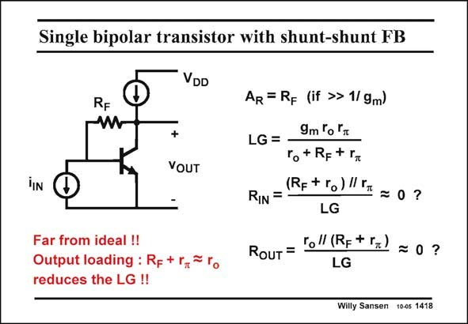

# SANSEN-1418 · Single bipolar transistor with shunt-shunt FB

章节：14 反馈跨阻放大器与电流放大器  
PDF 页：389；书本页：397；幻灯片编号：1418  
状态：unreviewed



## 对应教材讲解

### PDF 389 · 书本 397

Shunt-shunt feedback around a single-transistor amplifier is far from ideal: the loop gain is simply too small. Moreover, the feedback resistor R is compar- F able in size to the output resistance r . This causes o what is called ‘‘output loading’’. In all previous cases we had a source follower at the output. Now we do not. As a result, none of the simple equations that we have derived, provide accurate results. The closed loop gain is just about right, i.e. R . F The other quantities however, the loop gain and both the input and output impedances can only be approximated in a crude way by the simple expressions given in this slide. This is why question marks are added.

### PDF 390 · 书本 398

To obtain more accurate expressions the method has to be used, which always works but which asks much more analysis. The transistor has to be substituted by its small-signal equivalent circuit (with mainly g and r at low frequencies) and the equations stating the laws of Kirchoff m o have to be solved. Needless to say that SPICE or any other circuit similar circuit simulator should provide the same results.

## 公式／性能结论候选摘录

以下为规则截取的原文，尚未逐项判读。

- PDF 389: Shunt-shunt feedback around a single-transistor amplifier is far from ideal: the loop gain is simply too small.
- PDF 389: As a result, none of the simple equations that we have derived, provide accurate results.
- PDF 389: The closed loop gain is just about right, i.e.
- PDF 389: F The other quantities however, the loop gain and both the input and output impedances can only be approximated in a crude way by the simple expressions given in this slide.

## 曲线结论候选摘录

以下为规则截取的原文，尚未逐项判读。

（未由规则找到；不代表原页没有此类内容。）

## 原文条件与近似候选摘录

以下为规则截取的原文，尚未逐项判读。

- PDF 389: F The other quantities however, the loop gain and both the input and output impedances can only be approximated in a crude way by the simple expressions given in this slide.

## 幻灯片 OCR（未校正）

```text
Single bipolar transistor with shunt-shunt FB
VDD
RF
w
+
VOUT
IIN
Far from ideal !!
Output loading : Rp + r,*
reduces the LG !!
AR = RF (if »> 1/ 9m)
9m Гo °
LG =
ro+ Rp+ r
RIN =
(Rp+ ro) l II = 0?
LG
RouT = Fel (Rp+ r=)
= 0 ?
LG
Willy Sansen 10-05 1418
```

数学上下标、分数及正负号以原图为准。电路图已保留；未核对的连接不输出成可仿真 netlist。
