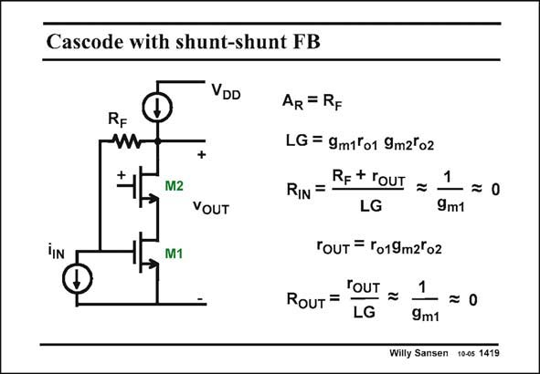

# SANSEN-1419 · Cascode with shunt-shunt FB

章节：14 反馈跨阻放大器与电流放大器  
PDF 页：390；书本页：398；幻灯片编号：1419  
状态：unreviewed



## 对应教材讲解

### PDF 390 · 书本 398

The loop gain LG can in principle be extended by addition of a cascode transistor M2. Its value will therefore be much larger. As a result, the expression for the closed loop transresistance will be closer to the value of R . F Because of the high loop gain LG, fairly accurate values of the input and output impedances can be obtained. The only way to verify them with this circuit is straightforward analysis by use of the two laws of Kirchoff. Note that both the input and output impedance are the same as for a diode connected transistor, i.e. 1/g .Resistor R does not come in as no Gate current is flowing. Also, cascode m1 F transistor M2 merely increases the loop gain. Using bipolar transistors rather than MOSTs would cause severe loading at both input and output!

## 公式／性能结论候选摘录

以下为规则截取的原文，尚未逐项判读。

- PDF 390: The loop gain LG can in principle be extended by addition of a cascode transistor M2.
- PDF 390: Its value will therefore be much larger.
- PDF 390: As a result, the expression for the closed loop transresistance will be closer to the value of R .
- PDF 390: F Because of the high loop gain LG, fairly accurate values of the input and output impedances can be obtained.
- PDF 390: Also, cascode m1 F transistor M2 merely increases the loop gain.

## 曲线结论候选摘录

以下为规则截取的原文，尚未逐项判读。

（未由规则找到；不代表原页没有此类内容。）

## 原文条件与近似候选摘录

以下为规则截取的原文，尚未逐项判读。

- PDF 390: Its value will therefore be much larger.

## 幻灯片 OCR（未校正）

```text
Cascode with shunt-shunt FB
iIN
VDD
RF
w
M2
VOUT
M1
AR = RF
LG = 9m1°o1 9m2lo2
RIN =
REt rouT = 1
-=0
LG
9m1
TOUT = To19m2°o2
ROUT=
roUT =
LG
—=0
9m1
Willy Sansen 10-05 1419
```

数学上下标、分数及正负号以原图为准。电路图已保留；未核对的连接不输出成可仿真 netlist。
