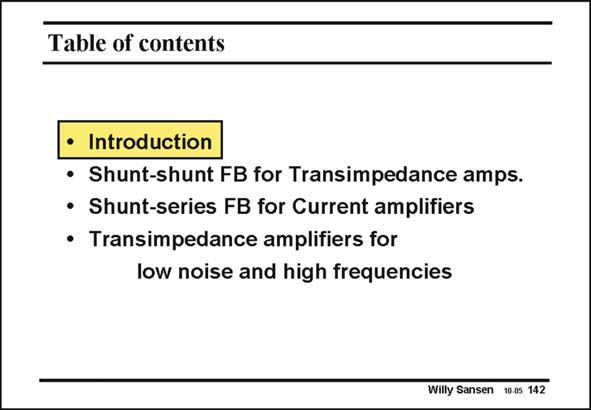

# SANSEN-142 · Table of contents

章节：14 反馈跨阻放大器与电流放大器  
PDF 页：381；书本页：389；幻灯片编号：142  
状态：unreviewed



## 对应教材讲解

### PDF 381 · 书本 389

First of all, we want to review some definitions. In particular we want to review the differences between the four types of feedback amplifiers. We will then focus on transimpedance amplifiers. They are used mainly for current sensors such as photodiodes, voltammetric sensors, etc. Current amplifiers are next. At the end, some different transimpedance amplifiers are added, as they are widely used for photodiode receivers. Attention is paid to low-noise and high-frequency performance.

## 公式／性能结论候选摘录

以下为规则截取的原文，尚未逐项判读。

（未由规则找到；不代表原页没有此类内容。）

## 曲线结论候选摘录

以下为规则截取的原文，尚未逐项判读。

（未由规则找到；不代表原页没有此类内容。）

## 原文条件与近似候选摘录

以下为规则截取的原文，尚未逐项判读。

（未由规则找到；不代表原页没有此类内容。）

## 幻灯片 OCR（未校正）

```text
Table of contents
• Introduction
• Shunt-shunt FB for Transimpedance amps.
• Shunt-series FB for Current amplifiers
Transimpedance amplifiers for
low noise and high frequencies
Willy Sansen 10.0s 142
```

数学上下标、分数及正负号以原图为准。电路图已保留；未核对的连接不输出成可仿真 netlist。
