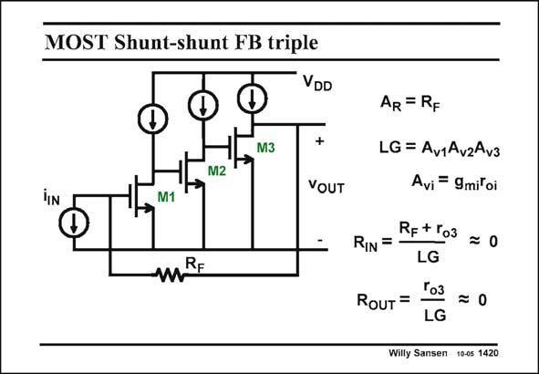

# SANSEN-1420 · MOST Shunt-shunt FB triple

章节：14 反馈跨阻放大器与电流放大器  
PDF 页：390；书本页：398；幻灯片编号：1420  
状态：unreviewed



## 对应教材讲解

### PDF 390 · 书本 398

A shunt-shunt feedback amplifier with three stages is shown in this slide. The closed loop transimpedance will be accurately R , F because of the high loop gain. All other quantities may have to be found through straightforward analysis. Since there is no output source follower, the output resistance at the drain of transistor M3 is fairly high. It is reduced by the loop gain LG however, so that the resulting value can still be quite low.

## 公式／性能结论候选摘录

以下为规则截取的原文，尚未逐项判读。

- PDF 390: The closed loop transimpedance will be accurately R , F because of the high loop gain.
- PDF 390: It is reduced by the loop gain LG however, so that the resulting value can still be quite low.

## 曲线结论候选摘录

以下为规则截取的原文，尚未逐项判读。

（未由规则找到；不代表原页没有此类内容。）

## 原文条件与近似候选摘录

以下为规则截取的原文，尚未逐项判读。

（未由规则找到；不代表原页没有此类内容。）

## 幻灯片 OCR（未校正）

```text
MOST Shunt-shunt FB triple
D
M3
M2
VDD
+
YOUT
M1
mRE
AR = RF
LG = Av1AvzAv3
Avi = 9mil oi
Rp + Го3
RIN =
LG
Tо3
RoUT =
= 0
LG
Willy Sansen 10-05 1420
```

数学上下标、分数及正负号以原图为准。电路图已保留；未核对的连接不输出成可仿真 netlist。
