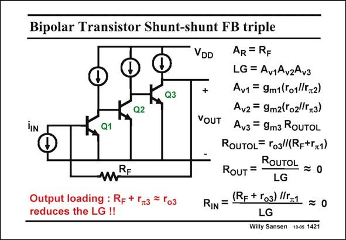

# SANSEN-1421 · Bipolar Transistor Shunt-shunt FB triple

章节：14 反馈跨阻放大器与电流放大器  
PDF 页：391；书本页：399；幻灯片编号：1421  
状态：unreviewed



## 对应教材讲解

### PDF 391 · 书本 399

Severe output loading is present in this three-stage shunt-shunt feedback amplifier with bipolar transistors. Only the expression of the closed loop transimpedance will be accurately R . All F other quantities need to be verified through straightforward analysis. Since there is no output source follower, the output resistance at the drain of transistor M3 is fairly high. Again, it is reduced by the high amount of loop gain. Resistor R comes in now however, as it conducts some base current as well. The open loop F output resistance R is output resistance r in parallel with feedback resistor R in series OUTOL o3 F with the input resistance of transistor Q1. The input resistance will be quite small as well.

## 公式／性能结论候选摘录

以下为规则截取的原文，尚未逐项判读。

- PDF 391: Again, it is reduced by the high amount of loop gain.

## 曲线结论候选摘录

以下为规则截取的原文，尚未逐项判读。

（未由规则找到；不代表原页没有此类内容。）

## 原文条件与近似候选摘录

以下为规则截取的原文，尚未逐项判读。

（未由规则找到；不代表原页没有此类内容。）

## 幻灯片 OCR（未校正）

```text
Bipolar Transistor Shunt-shunt FB triple
Q3
Q2
Q1
RF
Output loading : RF + Гт3
= Го3
reduces the LG !!
VDD
AR = RF
LG = Av1Av2Av3
+
Av1 = 9m1(Г01г,2)
Avz = 9m2(ro2lr3)
VOUT Av3= 9m3 RoUTOL
RouToL= ro3l(Rp+r+1)
RouT =
ROUTOL = 0
LG
RIN =
(RF + Г03) l5,1 = 0
Willy Sansen 10-05 1421
```

数学上下标、分数及正负号以原图为准。电路图已保留；未核对的连接不输出成可仿真 netlist。
