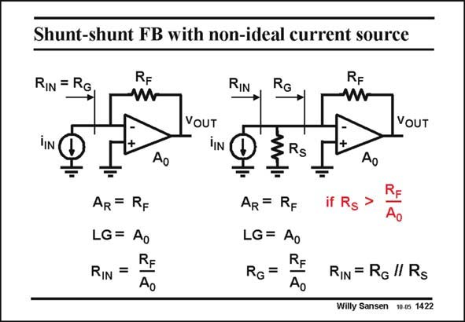

# SANSEN-1422 · Shunt-shunt FB with non-ideal current source

章节：14 反馈跨阻放大器与电流放大器  
PDF 页：391；书本页：399；幻灯片编号：1422  
状态：unreviewed



## 对应教材讲解

### PDF 391 · 书本 399

For shunt-shunt feedback with an ideal current source, the calculations are easy. They are given once more in this slide, on the left. The question now is, what happens if that current source is not that ideal? A source resistance R is now S in parallel with the current source i , as shown on the IN right. The question is rather how small can we allow that resistor R to be such that S our simple calculations are still valid. The answer is obvious as long as the source resistor R is larger than the closed-loop input S impedance, it will not affect the result. This input impedance is about R /A . It will be called F 0 R later on. G We find thus that we can keep the same expressions as before, as long as the source resistor R is larger than R /A (or R ). S F 0 G This means that we can still calculate the loop gain LG as if R were not there. This also S means that we now have two input resistances, one without R , which is R , and one with R , S G S which is R . Evidently, R is the parallel combination of R and R . Since R is much larger IN IN S G S than R however, the input resistances R and R are about the same. G IN G

## 公式／性能结论候选摘录

以下为规则截取的原文，尚未逐项判读。

- PDF 391: G We find thus that we can keep the same expressions as before, as long as the source resistor R is larger than R /A (or R ).
- PDF 391: S F 0 G This means that we can still calculate the loop gain LG as if R were not there.

## 曲线结论候选摘录

以下为规则截取的原文，尚未逐项判读。

（未由规则找到；不代表原页没有此类内容。）

## 原文条件与近似候选摘录

以下为规则截取的原文，尚未逐项判读。

- PDF 391: Since R is much larger IN IN S G S than R however, the input resistances R and R are about the same.

## 幻灯片 OCR（未校正）

```text
Shunt-shunt FB with non-ideal current source
RIN = RG
RIN
RG
VOUT
VOUT
TIN
TIN
Ao
Ao
AR = RF
LG = Ao
RIN =
Ao
AR = RF
LG = Ao
RG=
if Rs
RF
Ao
Ao
RIN = RG/ Rs
Willy Sansen 10.05 1422
```

数学上下标、分数及正负号以原图为准。电路图已保留；未核对的连接不输出成可仿真 netlist。
