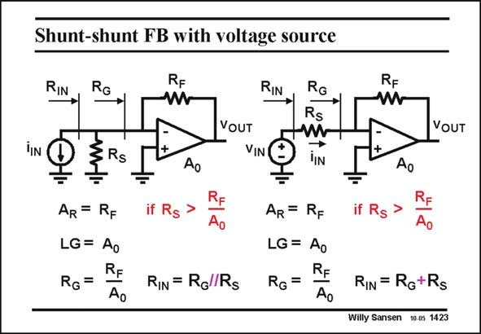

# SANSEN-1423 · Shunt-shunt FB with voltage source

章节：14 反馈跨阻放大器与电流放大器  
PDF 页：392；书本页：400；幻灯片编号：1423  
状态：unreviewed



## 对应教材讲解

### PDF 392 · 书本 400

This input current source i IN can also be substituted by a voltage source v with IN series resistor R provided S the input voltage v equals IN R i , as shown on the right. S IN Again, we have to assume that resistor R is much S larger than R or R /A . G F 0 The loop gain LG and transresistance A and resis- R tance at the Gate R are G now the same as before. The actual input resistance R , seen by the volt- IN age source, is now the sum of resistance R and resistor R . Since R is much larger than R , this input resistance R will G S S G IN thus be mainly R . S All input resistances are now known. The transresistance A is also known. Since we use a R voltage source however, we would also like to know the voltage gain A . This is given next. V

## 公式／性能结论候选摘录

以下为规则截取的原文，尚未逐项判读。

- PDF 392: This input current source i IN can also be substituted by a voltage source v with IN series resistor R provided S the input voltage v equals IN R i , as shown on the right.
- PDF 392: G F 0 The loop gain LG and transresistance A and resis- R tance at the Gate R are G now the same as before.
- PDF 392: Since R is much larger than R , this input resistance R will G S S G IN thus be mainly R .
- PDF 392: Since we use a R voltage source however, we would also like to know the voltage gain A .

## 曲线结论候选摘录

以下为规则截取的原文，尚未逐项判读。

（未由规则找到；不代表原页没有此类内容。）

## 原文条件与近似候选摘录

以下为规则截取的原文，尚未逐项判读。

- PDF 392: This input current source i IN can also be substituted by a voltage source v with IN series resistor R provided S the input voltage v equals IN R i , as shown on the right.
- PDF 392: S IN Again, we have to assume that resistor R is much S larger than R or R /A .
- PDF 392: Since R is much larger than R , this input resistance R will G S S G IN thus be mainly R .

## 幻灯片 OCR（未校正）

```text
Shunt-shunt FB with voltage source
RIN
RG
RF
W
RIN
RG
Rs
RF
iIN
VOUT
VIN
VOUT
Ao
Ao
AR = RF
LG= Ao
RG=
Ao
if Rg >
RE
Ao
AR = RF
LG = Ao
RIN = Rg Rs RG=
RE
Ao
if Rs >
RE
Ao
RIN = RG+Rs
Willy Sansen 10.05 1423
```

数学上下标、分数及正负号以原图为准。电路图已保留；未核对的连接不输出成可仿真 netlist。
