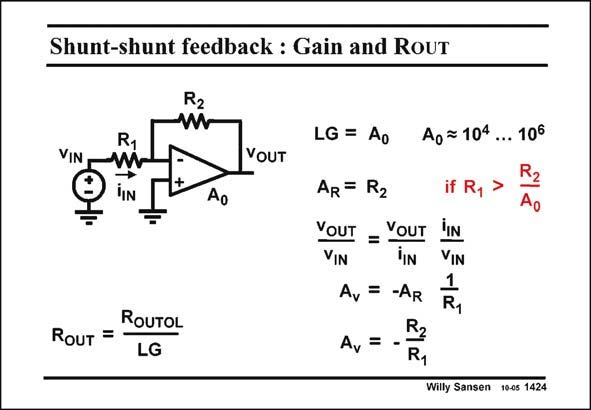

# SANSEN-1424 · Shunt-shunt feedback : Gain and RoUT

章节：14 反馈跨阻放大器与电流放大器  
PDF 页：392；书本页：400；幻灯片编号：1424  
状态：unreviewed



## 对应教材讲解

### PDF 392 · 书本 400

The voltage gain A then V simply becomes the ratio of the two resistors. Indeed it is derived in a simple way from the transresistance A R and resistor R , as shown in 1 this slide. This voltage gain A is V quite accurate, and nearly independent of the open loop gain A . For this 0 reason this amplifier has become famous. It has become one of the most widely used amplifiers with an operational amplifier. .It is called the inverting amplifier. The output resistance R will be quite small. Even without feedback, an opamp already OUT provides a low output resistance R . This is a result of the use of a source (or emitter) OUTOL follower at the output, inside the opamp. The application of feedback with a large loop gain LG decreases the output resistance to very small values!

## 公式／性能结论候选摘录

以下为规则截取的原文，尚未逐项判读。

- PDF 392: The voltage gain A then V simply becomes the ratio of the two resistors.
- PDF 392: This voltage gain A is V quite accurate, and nearly independent of the open loop gain A .
- PDF 392: The application of feedback with a large loop gain LG decreases the output resistance to very small values!

## 曲线结论候选摘录

以下为规则截取的原文，尚未逐项判读。

（未由规则找到；不代表原页没有此类内容。）

## 原文条件与近似候选摘录

以下为规则截取的原文，尚未逐项判读。

（未由规则找到；不代表原页没有此类内容。）

## 幻灯片 OCR（未校正）

```text
Shunt-shunt feedback : Gain and RoUT
R2
VIN
R1
TIN
YOUT
Ao
ROUTOL
Rouт =
LG
LG = Ao Ao= 104 ... 106
AR = R2
if R1
YOUT = VOUT
iIn
VIN
VIN
Av
=
1
-AR
R2
Av
Willy Sansen 10-05 1424
```

数学上下标、分数及正负号以原图为准。电路图已保留；未核对的连接不输出成可仿真 netlist。
