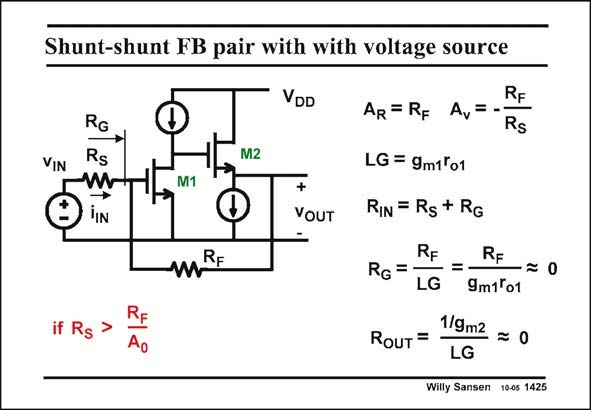

# SANSEN-1425 · Shunt-shunt FB pair with with voltage source

章节：14 反馈跨阻放大器与电流放大器  
PDF 页：393；书本页：401；幻灯片编号：1425  
状态：unreviewed



## 对应教材讲解

### PDF 393 · 书本 401

There are many ways to realize that opamp on the previous slide. Normally, an opamp has a differential pair at the input. A differential input is also possible however, by use of one single transistor. The gate is the minus input, whereas the source acts as the positive input. It is connected to ground. Since the transistor circuit is no more than a transistor realization of the opamp block, the same equations are valid as before. The values of the closed-loop gain and loop gain LG are readily copied. The gain A is now simply g r . 0 m1 o1 The results will not be as accurate as before however, because the gains are a bit too small with only one single amplifying transistor. As a result, the input resistance at the minus input R will not be that small. It is called R , G G and calculated as before. It will have to be added to the input series resistor R to give the input S resistance R seen by the input voltage source. IN

## 公式／性能结论候选摘录

以下为规则截取的原文，尚未逐项判读。

- PDF 393: The values of the closed-loop gain and loop gain LG are readily copied.
- PDF 393: The gain A is now simply g r . 0 m1 o1 The results will not be as accurate as before however, because the gains are a bit too small with only one single amplifying transistor.
- PDF 393: As a result, the input resistance at the minus input R will not be that small.

## 曲线结论候选摘录

以下为规则截取的原文，尚未逐项判读。

（未由规则找到；不代表原页没有此类内容。）

## 原文条件与近似候选摘录

以下为规则截取的原文，尚未逐项判读。

（未由规则找到；不代表原页没有此类内容。）

## 幻灯片 OCR（未校正）

```text
Shunt-shunt FB pair with with voltage source
VIN
VDD
RG
Rs
W
→
JIN
M2
M1
+
VOUT
mRE
RF
Ao
RF
AR = RF Av=-
Rs
LG = 9m1'o1
RIN = Rg + Rg
RF
RF
RG =-
- =-
-=0
LG 9m1°01
Rouт =
1/9m2 = 0
LG
Willy Sansen 10-05 1425
```

数学上下标、分数及正负号以原图为准。电路图已保留；未核对的连接不输出成可仿真 netlist。
