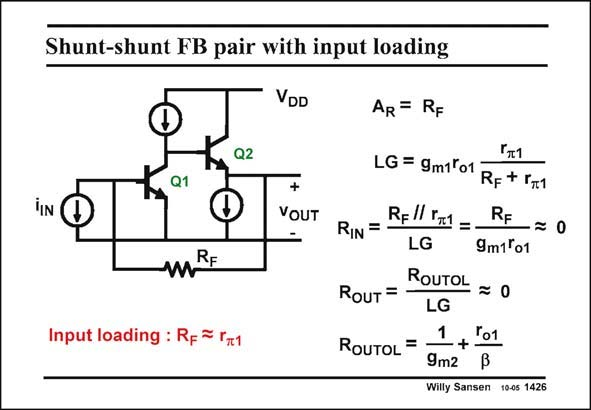

# SANSEN-1426 · Shunt-shunt FB pair with input loading

章节：14 反馈跨阻放大器与电流放大器  
PDF 页：393；书本页：401；幻灯片编号：1426  
状态：unreviewed



## 对应教材讲解

### PDF 393 · 书本 401

Even with an ideal input current source, input loading also shows up when the input resistance of the amplifier is not large. In this case, there is an interaction between feedback resistor R and input resistance r F p1 – they are in parallel for the input resistance. Moreover, they cause a voltage division in the loop gain LG. The output resistance will be quite small again, because a Source follower is used at the output. The output resistance without feedback is the output resistance of an emitter follower Q2. It must be divided by the loop gain to obtain the closed-loop output resistance.

## 公式／性能结论候选摘录

以下为规则截取的原文，尚未逐项判读。

- PDF 393: Moreover, they cause a voltage division in the loop gain LG.
- PDF 393: It must be divided by the loop gain to obtain the closed-loop output resistance.

## 曲线结论候选摘录

以下为规则截取的原文，尚未逐项判读。

（未由规则找到；不代表原页没有此类内容。）

## 原文条件与近似候选摘录

以下为规则截取的原文，尚未逐项判读。

（未由规则找到；不代表原页没有此类内容。）

## 幻灯片 OCR（未校正）

```text
Shunt-shunt FB pair with input loading
TIN
Q2
Q1
mRE
Input loading : Rp = Гz1
VDD
+
VOUT
AR = RF
Гт1
LG = 9m1'o1
RF+ I1
RIN
=
Rfl| I71 = -
RF
LG
•= 0
9m1°01
ROUTOL
RouT
-*0
LG
1
RoUToL =
-+-
Ґо1
9m2
Willy Sansen 10-05 1426
```

数学上下标、分数及正负号以原图为准。电路图已保留；未核对的连接不输出成可仿真 netlist。
