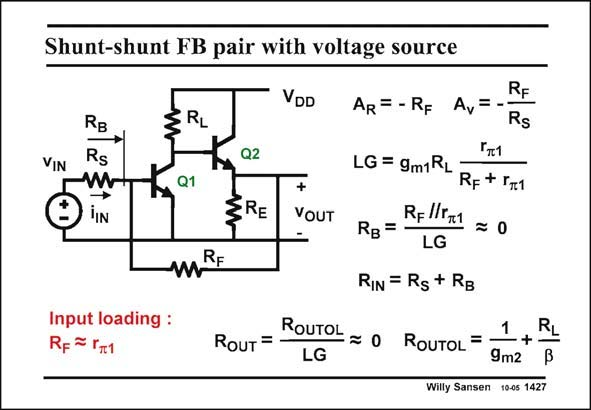

# SANSEN-1427 · Shunt-shunt FB pair with voltage source

章节：14 反馈跨阻放大器与电流放大器  
PDF 页：394；书本页：402；幻灯片编号：1427  
状态：unreviewed



## 对应教材讲解

### PDF 394 · 书本 402

Actually, all DC current sources can be substituted by resistances, as was common in discrete amplifiers. As a result, the gains will be somewhat lower. The same equations can still be used but they will be less accurate. Moreover, the input current source can be substituted by a voltage source with series resistor R . S Input loading is present again because bipolar transistors are used. Feedback resistor R will interact with the input resistor r of transistor Q1. F p1 The expressions have now become more evident.

## 公式／性能结论候选摘录

以下为规则截取的原文，尚未逐项判读。

- PDF 394: As a result, the gains will be somewhat lower.

## 曲线结论候选摘录

以下为规则截取的原文，尚未逐项判读。

（未由规则找到；不代表原页没有此类内容。）

## 原文条件与近似候选摘录

以下为规则截取的原文，尚未逐项判读。

（未由规则找到；不代表原页没有此类内容。）

## 幻灯片 OCR（未校正）

```text
Shunt-shunt FB pair with voltage source
VIN
RB
Rs
→
JIN
VDD
RL
Q2
Q1
ZRE
VOUT
RE
AR= -RF Av=
RF
Rs
Гт1
LG = 9m1RL
RF + IT1
R-//Г1
RB=
=0
LG
RIN = Rg + Rg
Input loading :
Rp = r1
RouT =
ROUTOL = 0 ROUTOL =
1
LG
9m2
Willy Sansen 10-05 1427
RL
```

数学上下标、分数及正负号以原图为准。电路图已保留；未核对的连接不输出成可仿真 netlist。
