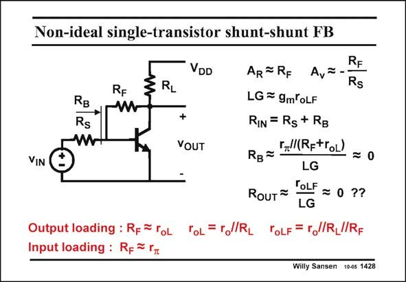

# SANSEN-1428 · Non-ideal single-transistor shunt-shunt FB

章节：14 反馈跨阻放大器与电流放大器  
PDF 页：394；书本页：402；幻灯片编号：1428  
状态：unreviewed



## 对应教材讲解

### PDF 394 · 书本 402

The most non-ideal feedback circuit that can be found, is probably the one using a single transistor only. This is a case of severe input loading AND output loading. Everything will interact with everything. It is clear that in this case, the feedback equations can hardly be applied. An attempt is made in this slide. Some approximate expressions are given. The only sure way to obtain an accurate result is to substitute the transistor by its equivalent circuit (with parameters g and r at low frequencies), and solve m o the Kirchoff equations. As a result this is one of the most complicated feedback circuits around, despite its simple circuit configuration.

## 公式／性能结论候选摘录

以下为规则截取的原文，尚未逐项判读。

- PDF 394: As a result this is one of the most complicated feedback circuits around, despite its simple circuit configuration.

## 曲线结论候选摘录

以下为规则截取的原文，尚未逐项判读。

（未由规则找到；不代表原页没有此类内容。）

## 原文条件与近似候选摘录

以下为规则截取的原文，尚未逐项判读。

- PDF 394: Some approximate expressions are given.

## 幻灯片 OCR（未校正）

```text
Non-ideal single-transistor shunt-shunt FB
DD
AR#RF A,=
ZRL
RF
Rs
RF
RB
Rs
LG = 9moLF
+
RIN = Rs + RB
VOUT
„l(RptroL)
VIN
RB-
= 0
LG
RouT=
TOLF = 0 ??
LG
Output loading : Rp = roL ToL= rl/RL TOLF = r//R_//RF
Input loading : Rp~ r
Willy Sansen 10-05 1428
```

数学上下标、分数及正负号以原图为准。电路图已保留；未核对的连接不输出成可仿真 netlist。
