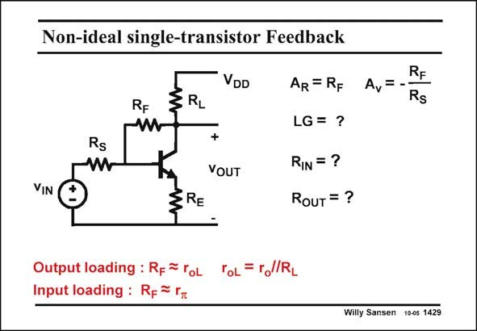

# SANSEN-1429 · Non-ideal single-transistor Feedback

章节：14 反馈跨阻放大器与电流放大器  
PDF 页：395；书本页：403；幻灯片编号：1429  
状态：unreviewed



## 对应教材讲解

### PDF 395 · 书本 403

Certainly, the most nonideal feedback circuit that can be found, is the one using one single transistor and a parallel feedback combined with series feedback. This is a case of severe input loading AND output loading. Everything will interact with everything. It is clear that in this case the feedback equations cannot be applied. An attempt is not even made. The only way to obtain an accurate result is to substitute the transistor by its equivalent circuit (with parameters g and r at low frequencies), and m o solve the Kirchoff equations. As a result, this is one of the most complicated feedback circuits, despite its simplicity.

## 公式／性能结论候选摘录

以下为规则截取的原文，尚未逐项判读。

- PDF 395: As a result, this is one of the most complicated feedback circuits, despite its simplicity.

## 曲线结论候选摘录

以下为规则截取的原文，尚未逐项判读。

（未由规则找到；不代表原页没有此类内容。）

## 原文条件与近似候选摘录

以下为规则截取的原文，尚未逐项判读。

（未由规则找到；不代表原页没有此类内容。）

## 幻灯片 OCR（未校正）

```text
Non-ideal single-transistor Feedback
VIN
Rs
RF
§RL
DD
+
VOUT
ERE
AR = RF A,=
LG = ?
RIN =?
RouT = ?
RF
Rs
Output loading : R-= roL ToL =rl/RL
Input loading : R= = г
Willy Sansen 10-05 1429
```

数学上下标、分数及正负号以原图为准。电路图已保留；未核对的连接不输出成可仿真 netlist。
