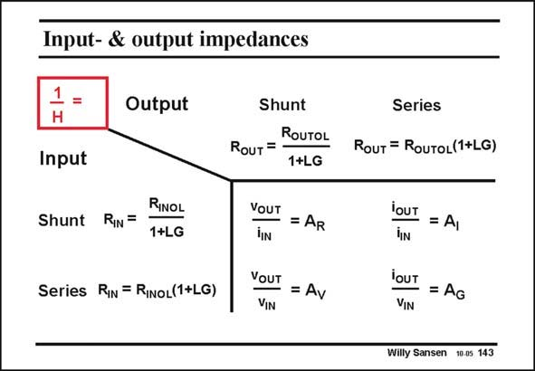

# SANSEN-143 · Input- & output impedances

章节：14 反馈跨阻放大器与电流放大器  
PDF 页：382；书本页：390；幻灯片编号：143  
状态：unreviewed



## 对应教材讲解

### PDF 382 · 书本 390

The different kinds of feedback give rise to different kinds of amplifiers. Seriesshunt feedback provides an amplifier with high precision in voltage gain A . V It is therefore a voltage amplifier. In a similar way, a shuntshunt feedback amplifier generates an accurate transresistance gain A . Both R input and output resistances will decrease. The input can then easily be driven by means of an input current. The output behaves as a voltage source. To realize a current amplifier, we have to apply shunt-series feedback. The input resistance is lowered to be able to allow the input current to flow. The output resistance is quite high, as for a current source. We have seen in the previous Chapter why we need these different kinds of amplifiers. We will now focus on the feedback amplifiers with shunt-feedback at the input, in order to be able to take an input current.

## 公式／性能结论候选摘录

以下为规则截取的原文，尚未逐项判读。

- PDF 382: Seriesshunt feedback provides an amplifier with high precision in voltage gain A .
- PDF 382: V It is therefore a voltage amplifier.
- PDF 382: In a similar way, a shuntshunt feedback amplifier generates an accurate transresistance gain A .
- PDF 382: Both R input and output resistances will decrease.

## 曲线结论候选摘录

以下为规则截取的原文，尚未逐项判读。

（未由规则找到；不代表原页没有此类内容。）

## 原文条件与近似候选摘录

以下为规则截取的原文，尚未逐项判读。

（未由规则找到；不代表原页没有此类内容。）

## 幻灯片 OCR（未校正）

```text
Input- & output impedances
1 =
H
Input
Output
Shunt
RIN =
RINOL
1+LG
Series RIN = RiNoL(1+LG)
Shunt
ROUTOL
RouT=
1+LG
VOUT = AR
YOUT = Av
Series
RouT = RouToL(1+LG)
iOUT = Al
iIN
iOUT = AG
VIN
Willy Sansen 10.0s 143
```

数学上下标、分数及正负号以原图为准。电路图已保留；未核对的连接不输出成可仿真 netlist。
