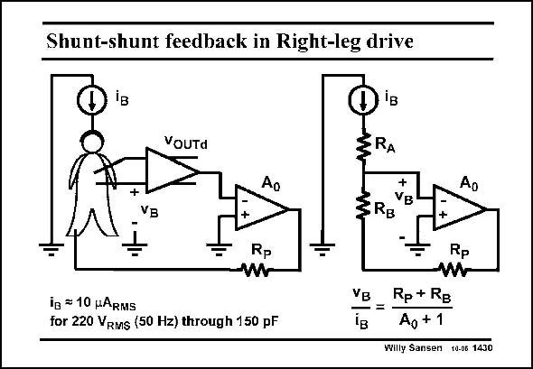

# SANSEN-1430 · Shunt-shunt feedback in Right-leg drive

章节：14 反馈跨阻放大器与电流放大器  
PDF 页：395；书本页：403；幻灯片编号：1430  
状态：unreviewed



## 对应教材讲解

### PDF 395 · 书本 403

A nice example of shuntshunt feedback is the rightleg drive used for measurements of small signals such as ECG, EEG, etc. on the human body. Such measurements are carried out by means of a differential amplifier, which provides a differential output voltage v . OUTd These measurements are disturbed however, by the injection of hum at 50 Hz coming from the mains. Each human body is capacitively coupled to the mains by capacitances of up to 150 pF. For a mains voltage of 220 V , RMS this correspond to an injected current of about 10 mA . In order to suppress the effect of this RMS current, a common-mode shunt-shunt feedback loop is arranged. The voltage v on the body, B caused by the injected current i , is then considerably reduced. B The equivalent circuit is shown on the right. The average output voltage is taken (e.g. by means of two resistors as shown in Chapter 8), and fed to a common-mode amplifier with gain A . The common-mode gain of the differential amplifier has been taken to be unity. 0 The output of amplifier A is applied to the right leg of the body, through a resistor R . This 0 P

### PDF 396 · 书本 404

resistor is needed for safety, in case the electronics break down. Typical values are 0.5 to 1 MV. The body itself is modeled by a few resistances R and R . Their values are of the order of A B magnitude of 10 kV. The voltage on the body v is reduced by the loop gain! B

## 公式／性能结论候选摘录

以下为规则截取的原文，尚未逐项判读。

- PDF 395: The average output voltage is taken (e.g. by means of two resistors as shown in Chapter 8), and fed to a common-mode amplifier with gain A .
- PDF 395: The common-mode gain of the differential amplifier has been taken to be unity. 0 The output of amplifier A is applied to the right leg of the body, through a resistor R .
- PDF 396: The voltage on the body v is reduced by the loop gain!

## 曲线结论候选摘录

以下为规则截取的原文，尚未逐项判读。

（未由规则找到；不代表原页没有此类内容。）

## 原文条件与近似候选摘录

以下为规则截取的原文，尚未逐项判读。

（未由规则找到；不代表原页没有此类内容。）

## 幻灯片 OCR（未校正）

```text
Shunt-shunt feedback in Right-leg drive
VoUTd
iB
RA
+
Ao
B
Ap
VB
RB
Rp
Rp
VB
iв = 10 pARMs
for 220 VRMS (50 Hz) through 150 pF
Rp + RB
Ag + 1
Willy Sansen 10-06 1430
```

数学上下标、分数及正负号以原图为准。电路图已保留；未核对的连接不输出成可仿真 netlist。
