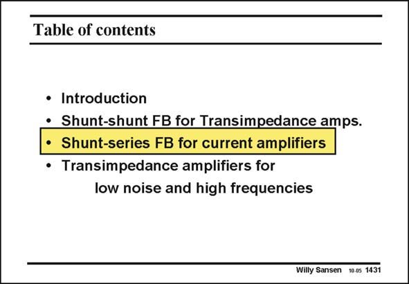

# SANSEN-1431 · Table of contents

章节：14 反馈跨阻放大器与电流放大器  
PDF 页：396；书本页：404；幻灯片编号：1431  
状态：unreviewed



## 对应教材讲解

### PDF 396 · 书本 404

Now that we know the principles of shunt-shunt feedback, let us learn about the other type of feedback with shunt feedback at the input. It also takes input currents. It has series feedback at the output. It acts as a current generator. It is therefore a current amplifier with gain A . It amplifies the I input current to the output with high precision. Its input resistance will be low and its output resistance high.

## 公式／性能结论候选摘录

以下为规则截取的原文，尚未逐项判读。

- PDF 396: It is therefore a current amplifier with gain A .

## 曲线结论候选摘录

以下为规则截取的原文，尚未逐项判读。

（未由规则找到；不代表原页没有此类内容。）

## 原文条件与近似候选摘录

以下为规则截取的原文，尚未逐项判读。

（未由规则找到；不代表原页没有此类内容。）

## 幻灯片 OCR（未校正）

```text
Table of contents
• Introduction
• Shunt-shunt FB for Transimpedance amps.
• Shunt-series FB for current amplifiers
• Transimpedance amplifiers for
low noise and high frequencies
Willy Sansen 10 as 1431
```

数学上下标、分数及正负号以原图为准。电路图已保留；未核对的连接不输出成可仿真 netlist。
