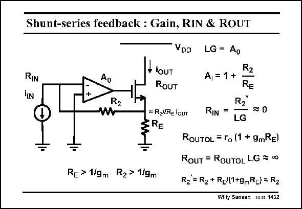

# SANSEN-1432 · Shunt-series feedback : Gain, RIN & ROUT

章节：14 反馈跨阻放大器与电流放大器  
PDF 页：396；书本页：404；幻灯片编号：1432  
状态：unreviewed



## 对应教材讲解

### PDF 396 · 书本 404

A shunt-series feedback amplifier with an opamp is shown in this slide. Usually, the feedback resistor R is 2 much larger than 1/g . m Resistor R is also much E larger than 1/g . m For the loop gain, the output transistor acts as a Source Follower. This is why the loop gain is the gain of the opamp A itself. The 0 current gain A is easily I found, once it has become clear that the input voltage of the opamp is about zero, because of the high gain A .This current gain is very precise indeed as it only depends on resistor 0 ratios. This is a real current amplifier indeed. The input resistance is just about R in an open loop. For a closed loop, it must be divided 2 by the loop gain LG. It is therefore small indeed. The output resistance will be very large, this is large because of the local feedback of resistor R . This increases because of the feedback. E

## 公式／性能结论候选摘录

以下为规则截取的原文，尚未逐项判读。

- PDF 396: Usually, the feedback resistor R is 2 much larger than 1/g . m Resistor R is also much E larger than 1/g . m For the loop gain, the output transistor acts as a Source Follower.
- PDF 396: This is why the loop gain is the gain of the opamp A itself.
- PDF 396: The 0 current gain A is easily I found, once it has become clear that the input voltage of the opamp is about zero, because of the high gain A .This current gain is very precise indeed as it only depends on resistor 0 ratios.
- PDF 396: For a closed loop, it must be divided 2 by the loop gain LG.
- PDF 396: It is therefore small indeed.
- PDF 396: This increases because of the feedback.

## 曲线结论候选摘录

以下为规则截取的原文，尚未逐项判读。

（未由规则找到；不代表原页没有此类内容。）

## 原文条件与近似候选摘录

以下为规则截取的原文，尚未逐项判读。

- PDF 396: Usually, the feedback resistor R is 2 much larger than 1/g . m Resistor R is also much E larger than 1/g . m For the loop gain, the output transistor acts as a Source Follower.

## 幻灯片 OCR（未校正）

```text
Shunt-series feedback : Gain, RIN & ROUT
VDD
RIN
Ao
LG = Ao
A, =1 +
R2
iouT
ROUT
= RZliRE lOUT
ERE
Re > 1/gm
R2> 1/gm
R2
R2
RIN =
LG
= 0
ROUTOL = ro (1 + 9mRE)
ROUT = ROUTOL LG = 00
Rz = R2 + R_J(1+gmR=) = R2
Willy Sansen 10-06 1432
```

数学上下标、分数及正负号以原图为准。电路图已保留；未核对的连接不输出成可仿真 netlist。
