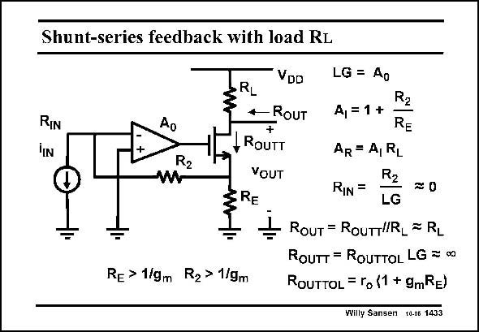

# SANSEN-1433 · Shunt-series feedback with load RL

章节：14 反馈跨阻放大器与电流放大器  
PDF 页：397；书本页：405；幻灯片编号：1433  
状态：unreviewed



## 对应教材讲解

### PDF 397 · 书本 405

Insertion of a load resistor in series with the output converts this circuit into a transimpedance amplifier with large gain A . R The loop gain and current gain are obviously the same as before. The transresistance A is simply the cur- R rent gain A times the load I resistor R . The input resis- L tance is the same as before. The output resistance R is now the parallel OUT combination of the transistor output resistance R , OUTT which is really large, and the load resistor R . It is mainly the load resistor R . L L

## 公式／性能结论候选摘录

以下为规则截取的原文，尚未逐项判读。

- PDF 397: Insertion of a load resistor in series with the output converts this circuit into a transimpedance amplifier with large gain A .
- PDF 397: R The loop gain and current gain are obviously the same as before.
- PDF 397: The transresistance A is simply the cur- R rent gain A times the load I resistor R .

## 曲线结论候选摘录

以下为规则截取的原文，尚未逐项判读。

（未由规则找到；不代表原页没有此类内容。）

## 原文条件与近似候选摘录

以下为规则截取的原文，尚未逐项判读。

（未由规则找到；不代表原页没有此类内容。）

## 幻灯片 OCR（未校正）

```text
Shunt-series feedback with load RL
RIN
Ao
R2
VDD
RL
-RoUT
+
ROUTT
VOUT
ERE
Re > 1/gm R2> 1/gm
LG = Ao
R2
A, = 1 +
RE
AR = A, RL
R2
RIN=
LG
ROUT = ROUTTRL = RL
ROUTT = ROUTTOL LG = o
ROUTTOL = ro (1 + 9mRe)
Willy Sansen 10-06 1433
```

数学上下标、分数及正负号以原图为准。电路图已保留；未核对的连接不输出成可仿真 netlist。
