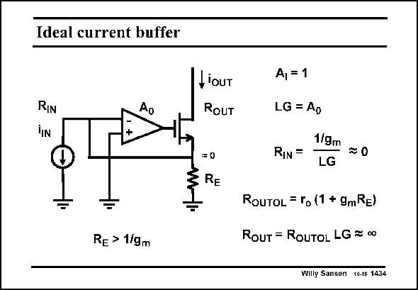

# SANSEN-1434 · Ideal current buffer

章节：14 反馈跨阻放大器与电流放大器  
PDF 页：397；书本页：405；幻灯片编号：1434  
状态：unreviewed



## 对应教材讲解

### PDF 397 · 书本 405

Omission of feedback resistor R gives the circuit in the 2 slide. Its current gain A is I now unity. Its input resistance is very small and its output resistance very large. It is therefore an ideal current buffer. It can also be called a current mirror, although this latter name is usually reserved for a current buffer with only a few devices, and hence with less ideal specifications.

## 公式／性能结论候选摘录

以下为规则截取的原文，尚未逐项判读。

- PDF 397: Its current gain A is I now unity.
- PDF 397: It is therefore an ideal current buffer.

## 曲线结论候选摘录

以下为规则截取的原文，尚未逐项判读。

（未由规则找到；不代表原页没有此类内容。）

## 原文条件与近似候选摘录

以下为规则截取的原文，尚未逐项判读。

（未由规则找到；不代表原页没有此类内容。）

## 幻灯片 OCR（未校正）

```text
Ideal current buffer
RIN
Ao
iouT
RouT
=0
§ RE
-
Re > 1/gm
A, = 1
LG = Ap
1/gm
RIN =
=0
LG
ROUTOL = ro (1 + gmRE)
ROUT = ROUTOL LG = 00
Willy Sansen 10-06 1434
```

数学上下标、分数及正负号以原图为准。电路图已保留；未核对的连接不输出成可仿真 netlist。
